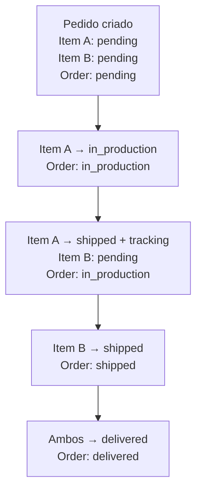
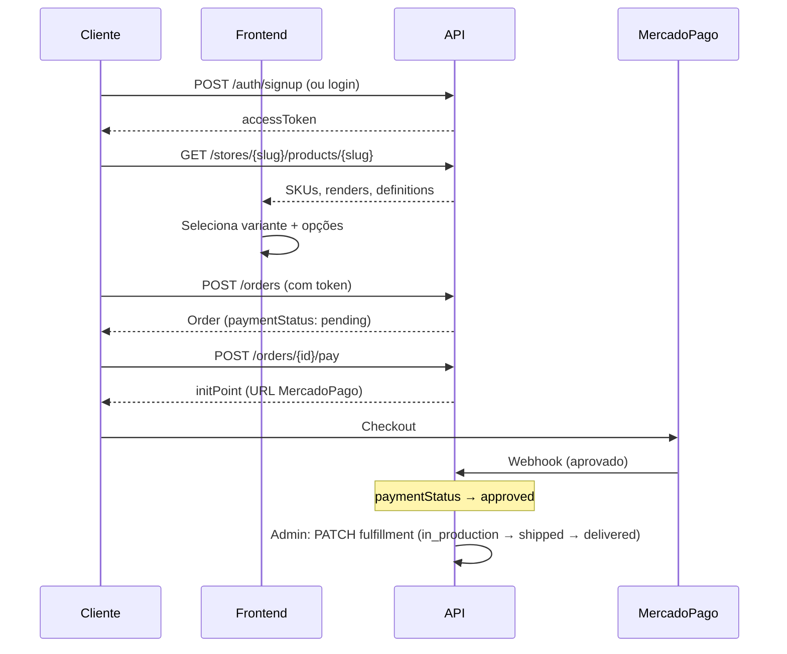

# Pedidos (Orders)

Endpoints para criar, pagar e acompanhar pedidos.

## Conceitos

- **Login obrigatório** — pedidos só podem ser criados por usuários autenticados
- **Multi-seller** — um pedido pode conter itens de múltiplos sellers
- **Snapshot de preços** — todos os valores são congelados no momento da criação. Alterações futuras no catálogo **não afetam** pedidos existentes
- **Fulfillment por item** — cada item tem seu próprio status e tracking, pois itens podem ser de fabricantes diferentes

### Status

| Campo | Nível | Valores |
| --- | --- | --- |
| `paymentStatus` | Order | `pending`, `approved`, `rejected`, `refunded`, `cancelled` |
| `fulfillmentStatus` | Item | `pending`, `in_production`, `shipped`, `delivered`, `returned` |
| `fulfillmentStatus` | Order | Derivado dos itens (automático) |

:::info Derivação do fulfillment da Order
- Todos `delivered` → Order `delivered`
- Todos `shipped` ou `delivered` → Order `shipped`
- Algum `returned` → Order `returned`
- Algum `in_production` → Order `in_production`
- Caso contrário → Order `pending`
:::

---

## Criar Pedido (Checkout)

```http
POST /orders
```

Requer autenticação (`Bearer token`).

```json
{
  "email": "cliente@email.com",
  "fullName": "João Silva",
  "phone": "+5511999999999",
  "shipping": {
    "cep": "01310100",
    "street": "Av Paulista",
    "number": "1000",
    "complement": "Apto 42",
    "neighborhood": "Bela Vista",
    "city": "São Paulo",
    "state": "SP",
    "country": "BR"
  },
  "items": [
    {
      "sellerProductId": "uuid-do-seller-product",
      "variantId": "uuid-do-seller-product-variant",
      "quantity": 2,
      "selectedOptions": { "color": "black" }
    }
  ],
  "shippingCents": 1590,
  "discountCents": 0,
  "shippingMethodId": "sedex",
  "carrier": "Correios",
  "serviceCode": "04014"
}
```

**Validações:**

| Campo | Regra |
|---|---|
| `email` | Obrigatório, max 255 chars |
| `fullName` | Obrigatório, max 200 chars |
| `phone` | Opcional, formato E.164 (`+5511999999999`) |
| `shipping.cep` | 8-10 chars |
| `shipping.state` | 2 chars (UF) |
| `items` | Mínimo 1 item |
| `items[].quantity` | 1 a 100 |
| `items[].selectedOptions` | Validado contra `allowedOptions` do SKU |

---

## Pagamento (MercadoPago)

### Iniciar pagamento

```http
POST /orders/{orderId}/pay
```

Cria uma preferência MercadoPago e retorna a URL de checkout. Pode ser chamado múltiplas vezes para retry.

:::warning Pré-condição
`paymentStatus` deve ser `pending` ou `rejected`.
:::

<details>
<summary>Response</summary>

```json
{
  "orderId": "uuid-do-pedido",
  "initPoint": "https://www.mercadopago.com.br/checkout/v1/redirect?pref_id=...",
  "preferenceId": "mp-preference-id"
}
```

</details>

### Simular pagamento (dev only)

```http
POST /orders/{orderId}/dev-pay
```

:::tip Apenas em ambiente de desenvolvimento
Simula pagamento aprovado sem MercadoPago. Seta `paymentStatus = approved` e `paidAt` com timestamp atual.
:::

---

## Consultar Pedido

```http
GET /orders/{orderId}
```

Requer autenticação (dono do pedido ou admin).

## Listar Meus Pedidos

```http
GET /orders/me?skip=0&limit=100
```

**Filtros opcionais:** `payment_status`, `fulfillment_status`, `search`, `created_at`, `created_from`, `created_to`

## Listar Todos (Admin)

```http
GET /orders?skip=0&limit=100
```

**Filtros adicionais:** `user_id`, `email`

- `search` — busca parcial em orderNumber, email, fullName
- `created_from` / `created_to` — range de datas (ISO 8601)

---

## Pedidos do Seller

```http
GET /orders/seller/me
```

Retorna pedidos completos que contêm itens do seller.

```http
GET /orders/seller/items?skip=0&limit=100
```

Retorna apenas os **itens** do seller (não o pedido completo).

---

## Fulfillment (Admin)

```http
PATCH /orders/items/{itemId}/fulfillment
```

```json
{
  "fulfillmentStatus": "shipped",
  "trackingCode": "BR123456789"
}
```

Recalcula automaticamente o `fulfillmentStatus` da Order pai.

### Exemplo de fluxo



---

## Fórmula de Ganhos do Artista

```
platform_fee    = price × platformFeePercent / 100
profit          = price − baseCost − platform_fee
artist_earnings = profit × artistRoyaltyPercent / 100
```

---

## Fluxo Completo de Compra


