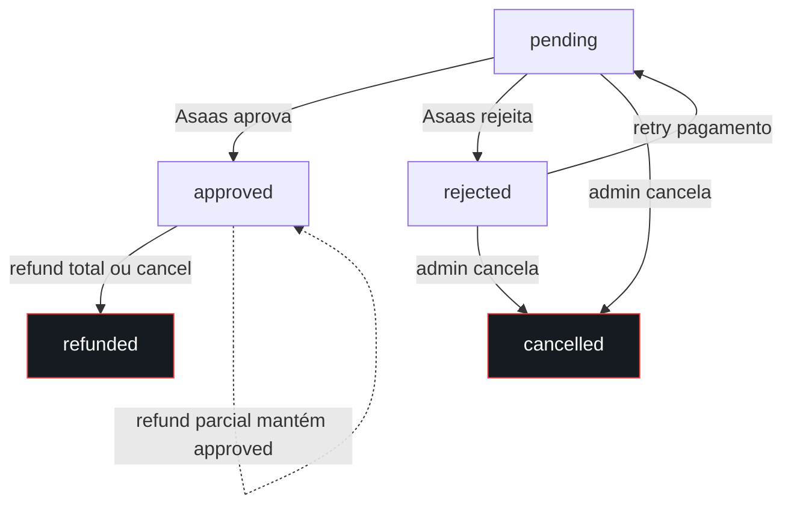
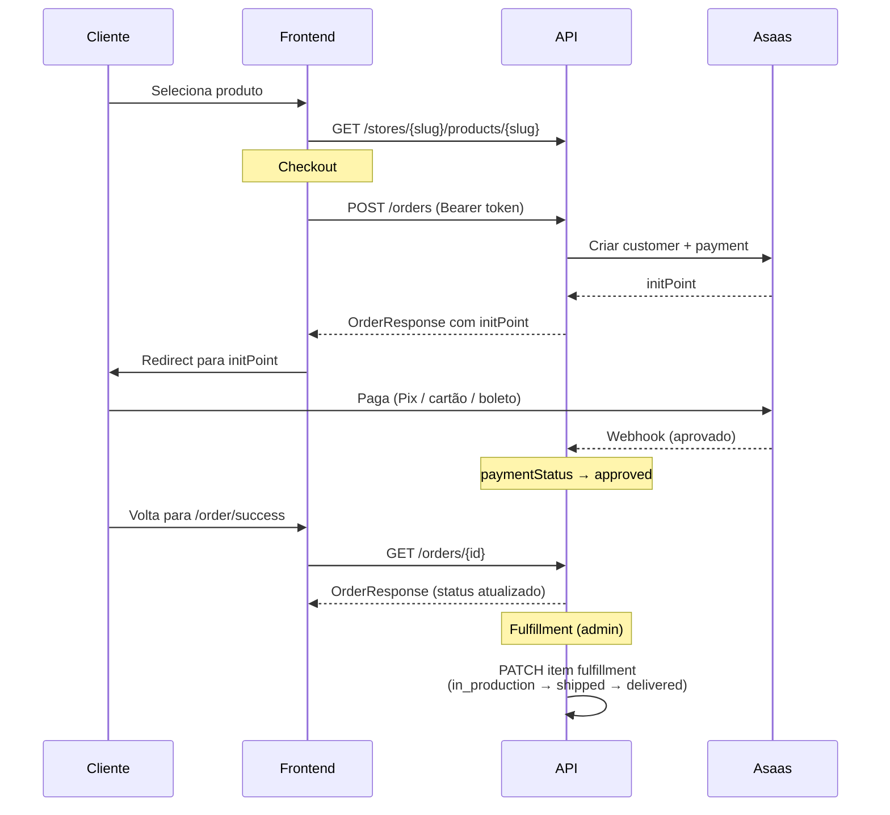

# Pedidos (Orders)

Endpoints para criar, pagar e acompanhar pedidos. Integração de pagamento via **Asaas** (Pix, cartão e boleto).

## Conceitos

- **Login obrigatório** — pedidos só podem ser criados por usuários autenticados. O `userId` é vinculado automaticamente.
- **Multi-seller** — um pedido pode conter itens de múltiplos sellers. Cada item rastreia o `sellerProfileId` para cálculo de comissão.
- **Snapshot de preços** — todos os valores (preço, custo base, taxas, comissão) são congelados no momento da criação. Alterações futuras no catálogo **não afetam** pedidos existentes.
- **Ownership** — todos os endpoints verificam que o pedido pertence ao usuário autenticado (ou admin).
- **Pagamento** — integração com **Asaas**. Suporta Pix, cartão e boleto. Múltiplas tentativas por pedido. Suporta reembolso total/parcial e cancelamento com estorno automático. **Exige CPF/CNPJ do comprador** (ver [Atualizar Perfil](/docs/api-reference/auth#atualizar-perfil)).
- **Fulfillment por item** — cada item tem seu próprio `fulfillmentStatus` e `trackingCode`, pois itens podem ser produzidos/enviados por fabricantes diferentes. O status da Order é derivado dos itens.

## Status do Pedido

| Campo | Nível | Valores |
|---|---|---|
| `paymentStatus` | Order | `pending`, `approved`, `rejected`, `refunded`, `cancelled` |
| `fulfillmentStatus` | Item | `pending`, `in_production`, `shipped`, `delivered`, `returned` |
| `fulfillmentStatus` | Order | Derivado dos itens (automático) |

:::info Derivação do fulfillment da Order
- Todos `delivered` → Order `delivered`
- Todos `shipped` ou `delivered` → Order `shipped`
- Algum `returned` → Order `returned`
- Algum `in_production` → Order `in_production`
- Caso contrário → Order `pending`
:::

### Transições de paymentStatus


```mermaid
graph TD
    pending[pending]
    approved[approved]
    rejected[rejected]
    refunded[refunded]
    cancelled[cancelled]

    pending -->|Asaas aprova| approved
    pending -->|Asaas rejeita| rejected
    pending -->|admin cancela| cancelled
    rejected -->|retry pagamento| pending
    rejected -->|admin cancela| cancelled
    approved -->|refund total ou cancel| refunded
    approved -.->|refund parcial mantém approved| approved

    classDef terminal fill:#161b22,stroke:#ef4444,color:#fff
    class refunded,cancelled terminal
```

| `paymentStatus` atual | Ações permitidas | Endpoint |
|---|---|---|
| `pending` | Retry, cancelar, simular (dev) | `POST /pay`, `POST /cancel`, `POST /dev-pay` |
| `approved` | Reembolsar (total/parcial), cancelar (com refund automático) | `POST /refund`, `POST /cancel` |
| `rejected` | Retry pagamento, cancelar | `POST /pay`, `POST /cancel` |
| `refunded` | Nenhuma (terminal) | — |
| `cancelled` | Nenhuma (terminal) | — |

:::warning Estados terminais
`refunded` e `cancelled` não permitem nenhuma ação. Tentativas retornam erro 400.
:::

---

## Fluxo Completo de Compra


```mermaid
sequenceDiagram
    participant Cliente
    participant Frontend
    participant API
    participant Asaas

    Cliente->>Frontend: Seleciona produto
    Frontend->>API: GET /stores/{slug}/products/{slug}

    Note over Frontend: Checkout
    Frontend->>API: POST /orders (Bearer token)
    API->>Asaas: Criar customer + payment
    Asaas-->>API: initPoint
    API-->>Frontend: OrderResponse com initPoint

    Frontend->>Cliente: Redirect para initPoint
    Cliente->>Asaas: Paga (Pix / cartão / boleto)
    Asaas-->>API: Webhook (aprovado)
    Note over API: paymentStatus → approved

    Cliente->>Frontend: Volta para /order/success
    Frontend->>API: GET /orders/{id}
    API-->>Frontend: OrderResponse (status atualizado)

    Note over API: Fulfillment (admin)
    API->>API: PATCH item fulfillment<br/>(in_production → shipped → delivered)
```

---

## 1. Criar Pedido + Iniciar Pagamento (Checkout)

```http
POST /orders
```

Requer autenticação. Em **uma única chamada**: cria o pedido, faz snapshot de preços, cria customer + payment no Asaas, e retorna `initPoint` pronto para redirect.

```json
{
  "fullName": "João Silva",
  "phone": "+5511999999999",
  "shipping": {
    "cep": "01310100",
    "street": "Av Paulista",
    "number": "1000",
    "complement": "Apto 42",
    "neighborhood": "Bela Vista",
    "city": "São Paulo",
    "state": "SP",
    "country": "BR"
  },
  "items": [
    {
      "sellerProductId": "uuid-do-seller-product",
      "variantId": "uuid-do-seller-product-variant",
      "quantity": 2,
      "selectedOptions": { "color": "black" }
    }
  ],
  "shippingCents": 1590,
  "discountCents": 0,
  "shippingMethodId": "sedex",
  "carrier": "Correios",
  "serviceCode": "04014"
}
```

| Campo | Regra |
|---|---|
| `email` | **Não enviado no body** — usa automaticamente o email do usuário autenticado |
| `fullName` | **Opcional**, max 200 chars. Se omitido, usa `user.name`. Útil para entrega em nome de outra pessoa |
| `phone` | **Opcional**, formato E.164 (`+5511999999999`). Se omitido, usa `user.whatsapp` |
| `shipping` | Obrigatório (endereço de entrega) |
| `shipping.cep` | 8-10 chars |
| `shipping.state` | 2 chars (UF) |
| `items` | Mínimo 1 item |
| `items[].quantity` | 1 a 100 |
| `items[].selectedOptions` | Obrigatório quando a variant tem `allowedOptions` |

:::danger Exige CPF/CNPJ do usuário
Se o usuário não tem `documentNumber` salvo, este endpoint retorna **erro**. Colete e envie via `PATCH /users/me` antes do checkout. Ver [Atualizar Perfil](/docs/api-reference/auth#atualizar-perfil).
:::

**Response (201):** `OrderResponse` completo com `initPoint` preenchido.

**Frontend:**

```typescript
const order = await api.createOrder(checkoutData);
window.location.href = order.initPoint;
```

---

## 2. Retry de Pagamento

```http
POST /orders/{orderId}/pay
```

Cria **novo** payment no Asaas para um pedido existente. Use quando o `initPoint` anterior expirou ou ficou inválido.

**Pré-condição:** `paymentStatus` deve ser `pending` ou `rejected`.

:::info Na maioria dos casos, não é necessário
O mesmo `initPoint` permite múltiplas tentativas no Asaas (cartão rejeitado → tentar outro). Só chame `/pay` quando o link em si parar de funcionar.
:::

<details>
<summary>Response</summary>

```json
{
  "orderId": "uuid",
  "initPoint": "https://www.asaas.com/i/pay_xxxx",
  "sandboxInitPoint": null,
  "preferenceId": "202809963-920c288b-..."
}
```

</details>

---

## 3. Simular Pagamento (Dev Only)

```http
POST /orders/{orderId}/dev-pay
```

Disponível apenas em `ENVIRONMENT=local`/`development`/`dev`. Simula pagamento aprovado sem chamar o Asaas — útil quando não há tunnel configurado.

**Pré-condição:** `paymentStatus` em `pending` ou `rejected`.

**Response:** `OrderResponse` com `paymentStatus: "approved"`.

---

## 4. Consultar Pedido

```http
GET /orders/{orderId}
```

Requer autenticação (dono do pedido ou admin).

:::tip Fluxo após redirect do Asaas
Depois que o Asaas redireciona para `/order/success`, o frontend deve consultar este endpoint para confirmar o status real do pagamento. **O webhook é a fonte de verdade**, não os query params do redirect.
:::

Para pedidos em `pending`/`rejected`, o `initPoint` vem preenchido (reconstruído a partir do `providerPreferenceId` salvo). Para pedidos pagos/cancelados, `initPoint` é `null`.

---

## 5. Listar Pedidos

### Meus pedidos

```http
GET /orders/me?skip=0&limit=100
```

**Filtros opcionais:** `payment_status`, `fulfillment_status`, `search`, `created_at`, `created_from`, `created_to`.

### Todos (admin)

```http
GET /orders?skip=0&limit=100
```

**Filtros adicionais:** `user_id`, `email`.

### Pedidos do seller

```http
GET /orders/seller/me
```

Pedidos completos que contêm itens do seller.

```http
GET /orders/seller/items?skip=0&limit=100
```

Apenas os **itens** do seller (mais leve, ideal para dashboard do seller).

---

## 6. Atualizar Fulfillment de Item (Admin)

```http
PATCH /orders/items/{itemId}/fulfillment
```

```json
{
  "fulfillmentStatus": "shipped",
  "trackingCode": "BR123456789"
}
```

**Valores:** `pending`, `in_production`, `shipped`, `delivered`, `returned`.

O `fulfillmentStatus` da Order pai é recalculado automaticamente.

### Exemplo de fluxo com 2 itens

```
1. Pedido criado      → Item A: pending, Item B: pending     → Order: pending
2. PATCH A            → A: in_production                      → Order: in_production
3. PATCH A (tracking) → A: shipped, B: pending               → Order: in_production
4. PATCH B            → A: shipped, B: shipped               → Order: shipped
5. PATCH A + B        → ambos delivered                       → Order: delivered
```

---

## 7. Reembolsar Pedido (Admin)

```http
POST /orders/{orderId}/refund
```

Reembolso **total** ou **parcial** via API do Asaas. Suporta múltiplos reembolsos parciais desde que a soma não ultrapasse o total original.

**Pré-condição:** `paymentStatus == "approved"` com `providerPaymentId` real (não simulado).

```json
{ "amountCents": 5600 }
```

| Campo | Obrigatório | Descrição |
|---|:---:|---|
| `amountCents` | Não | Valor a reembolsar (centavos). Se omitido/`null` → reembolso **total** |

### Comportamento

| Tipo | Body | `paymentStatus` após | Quando usar |
|---|---|---|---|
| **Total** | Sem body ou `amountCents: null` | `refunded` | Cancelar pedido inteiro |
| **Parcial** | `amountCents: 2800` | Mantém `approved` | Devolver item específico |
| **Parcial (último)** | Soma ≥ total | `refunded` | Último refund atinge o total |

<details>
<summary>Exemplo — reembolso de itens individuais</summary>

```
Pedido: R$ 71,90 (produtos: R$ 56,00 + frete: R$ 15,90)

1. Reembolsar item A (R$ 28,00):
   POST /orders/{id}/refund { "amountCents": 2800 }
   → status: "partial_refund", totalRefundedCents: 2800
   → paymentStatus continua "approved"

2. Reembolsar item B (R$ 28,00):
   POST /orders/{id}/refund { "amountCents": 2800 }
   → totalRefundedCents: 5600 (continua approved)

3. Reembolsar frete (R$ 15,90) — total atingido:
   POST /orders/{id}/refund { "amountCents": 1590 }
   → status: "refunded", totalRefundedCents: 7190
   → paymentStatus → "refunded"
```

</details>

**Response:**

```json
{
  "orderId": "uuid",
  "refundId": "1009042015",
  "amountCents": 2800,
  "totalRefundedCents": 2800,
  "status": "partial_refund"
}
```

---

## 8. Cancelar Pedido (Admin)

```http
POST /orders/{orderId}/cancel
```

Cancela o pedido. Se já foi pago, emite **refund total** no Asaas automaticamente.

**Pré-condição:** `paymentStatus` não pode ser `cancelled` nem `refunded`.

| Estado atual | Ação no Asaas | Status final |
|---|---|---|
| `approved` | Refund total automático | `refunded` |
| `pending` (com payment no Asaas) | Cancel no Asaas | `cancelled` |
| `pending`/`rejected` (sem Asaas) | Nenhuma | `cancelled` |

:::tip Cancelamento com reembolso parcial
Para descontar frete ou reter parte do valor: chame `/refund` com `amountCents` primeiro, depois `/cancel`.
:::

---

## Fórmula de Ganhos do Artista

Calculada no momento do pedido (snapshot):

```
platform_fee    = price × platformFeePercent / 100
profit          = price − baseCost − platform_fee
artist_earnings = profit × artistRoyaltyPercent / 100
```

Os percentuais (`platformFeePercent`, `artistRoyaltyPercent`) vêm do **ProductType** da variante e são **configuráveis por produto**.

---

## Schemas de Resposta

### OrderResponse

<details>
<summary>JSON completo</summary>

```json
{
  "id": "uuid",
  "orderNumber": 1001,
  "email": "cliente@email.com",
  "fullName": "João Silva",
  "phone": "+5511999999999",
  "userId": "uuid",
  "shippingCep": "01310100",
  "shippingStreet": "Av Paulista",
  "shippingNumber": "1000",
  "shippingComplement": "Apto 42",
  "shippingNeighborhood": "Bela Vista",
  "shippingCity": "São Paulo",
  "shippingState": "SP",
  "shippingCountry": "BR",
  "paymentStatus": "pending",
  "fulfillmentStatus": "pending",
  "subtotalCents": 9980,
  "shippingCents": 1590,
  "discountCents": 0,
  "totalCents": 11570,
  "items": [
    {
      "id": "uuid",
      "sellerProductId": "uuid",
      "productVariantId": "uuid",
      "sellerProfileId": "uuid",
      "artworkId": "uuid",
      "quantity": 2,
      "unitPriceCents": 4990,
      "lineTotalCents": 9980,
      "title": "Caneca Arte Tropical",
      "imageUrl": "https://cdn.../render.webp",
      "optionLabel": "350ml · Brilhante · Preto",
      "variantAssets": { "size": "350ml", "finish": "glossy" },
      "selectedOptions": { "color": "black" },
      "sellerName": "Arte do João",
      "sellerSlug": "arte-do-joao",
      "productTypeName": "Caneca Cerâmica",
      "productionDays": 3,
      "packagingDays": 1,
      "fulfillmentStatus": "pending",
      "trackingCode": null,
      "shippedAt": null,
      "deliveredAt": null
    }
  ],
  "payment": {
    "id": "uuid",
    "paymentProvider": "asaas",
    "providerPreferenceId": "202809963-920c288b-...",
    "providerPaymentId": null,
    "status": "pending",
    "amountCents": 11570,
    "paidAt": null,
    "createdAt": "2026-04-02T10:00:00Z"
  },
  "shipment": null,
  "initPoint": "https://sandbox.asaas.com/i/pay_xxxx",
  "sandboxInitPoint": null,
  "createdAt": "2026-04-02T10:00:00Z",
  "updatedAt": "2026-04-02T10:00:00Z",
  "paidAt": null,
  "shippedAt": null,
  "deliveredAt": null
}
```

</details>

:::info `initPoint` e `sandboxInitPoint`
Preenchidos apenas no `POST /orders` (criação). Em consultas posteriores (`GET /orders/{id}`) vêm `null` — o frontend não precisa deles depois do redirect inicial.
:::

### OrderListResponse

```json
{
  "orders": ["...OrderResponse[]"],
  "total": 42,
  "skip": 0,
  "limit": 100
}
```

### SellerOrderItemResponse

Retornado em `GET /orders/seller/items`. Mais leve — só o necessário para o dashboard do seller.

```json
{
  "id": "uuid",
  "orderId": "uuid",
  "orderNumber": 1001,
  "quantity": 2,
  "unitPriceCents": 4990,
  "lineTotalCents": 9980,
  "artistEarningsCents": 1247,
  "title": "Caneca Arte Tropical",
  "imageUrl": "https://cdn.../render.webp",
  "paymentStatus": "approved",
  "fulfillmentStatus": "pending",
  "orderCreatedAt": "2026-04-02T10:00:00Z"
}
```
