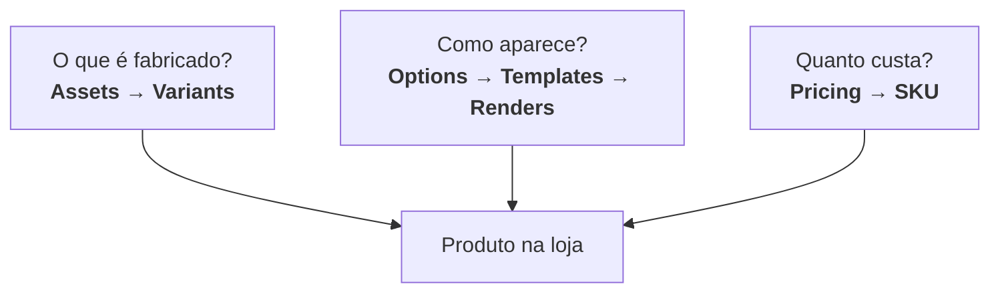

# Regras de Negócio

Estas são as regras fundamentais que governam como produtos são estruturados, precificados e exibidos na Labanana.

:::danger Por que isso importa
Se você errar aqui, o sistema quebra: SKU errado, preço errado, render errado, produto invisível na loja. Essas regras protegem a integridade de todo o fluxo.
:::

## Os 3 pilares



| Pilar | Quem controla | Impacto |
|---|---|---|
| **Fabricação** (Assets + Variants) | Admin | Define o que é produzido e o custo |
| **Visual** (Options + Templates + Renders) | Admin + Seller | Define como o produto aparece na loja |
| **Preço** (Pricing) | Admin + Seller | Define margem e viabilidade |

---

## Referência rápida

### Assets vs Options

:::tip Regra principal
**Assets** definem produção. **Options** definem visual. Nunca confunda os dois.
:::

- Se muda o que é produzido → **Asset**
- Se é apenas visual → **Option**
- Options **nunca** afetam preço
- Uma value por key: `{ "color": "red" }`, nunca arrays

```json
// Correto
{ "size": "350ml", "finish": "glossy" }

// Errado -- nunca multiplos valores
{ "size": ["350ml", "700ml"] }
```

### Variants

:::warning Regra crítica
Variants contêm **apenas assets**. Options nunca entram na variant.
:::

- Cada combinação de assets deve ser **única** por ProductType
- Igualdade é **exata** — `{size: "350ml"}` ≠ `{size: "350ml", finish: "glossy"}`
- `generate-variants` usa **todas** as keys ativas (produto cartesiano completo)

```json
// Variant válida — apenas assets
{
  "assets": { "size": "350ml", "finish": "glossy" },
  "baseCostCents": 1500
}
```

### Templates e Renders

:::info Match por subset
O template casa com qualquer variant que **contenha** todos os assets do template. Menos assets = mais variantes atendidas.
:::

- `assets: {}` → casa com **todas** as variantes
- `options: null` → funciona para **qualquer** option
- Se o asset não muda o mockup → **não incluir** no template

```json
// Template que casa com 350ml glossy E 350ml matte
{
  "assets": { "size": "350ml" },
  "options": { "color": "black" }
}
```

### Preços

- Todos os valores em **centavos** (inteiros, nunca float)
- Preço mínimo: `priceCents > baseCostCents + platformFee`
- Mudar assets → muda SKU → **muda preço**
- Mudar options → **nunca** muda preço

### Renders

- Render **não é automático** — seller escolhe quais templates renderizar
- PrintArea aceita **5% de sangria** (tolerância de overflow)
- Preview e render usam **exatamente a mesma** validação
- Coordenadas em pixels, relativas ao sourceImage (canto superior esquerdo)

### Soft Delete

- Nenhum delete é físico — tudo é `is_active = false`
- **Sem cascata automática** — admin desativa dependentes manualmente
- API protege contra criação de vínculos com recursos inativos
- Pedidos existentes **nunca** são afetados (snapshot)
