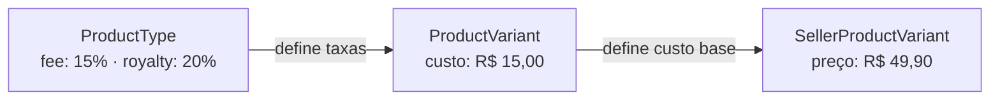

import WaterfallChart from '@site/src/components/WaterfallChart';

# Modelo de Preços

O sistema de preços da Labanana é baseado em três níveis: custo de produção, taxa da plataforma e margem do artista.

## Estrutura



| Nível | Quem define | Campo |
|---|---|---|
| ProductType | Admin | `platformFeePercent`, `artistRoyaltyPercent` |
| ProductVariant | Admin | `baseCostCents` (custo de produção) |
| SellerProductVariant | Seller | `priceCents` (preço final de venda) |

## Exemplo prático — Caneca a R$ 49,90

<WaterfallChart
  title="Decomposição do preço"
  steps={[
    { label: 'Preço de venda', value: 4990, type: 'start' },
    { label: 'Custo de produção', value: 1500, type: 'subtract', recipient: 'Fornecedor' },
    { label: 'Taxa plataforma (15%)', value: 749, type: 'subtract', recipient: 'Operacional' },
    { label: 'Margem', value: 2741, type: 'subtotal' },
    { label: 'Royalty artista (20%)', value: 548, type: 'split', recipient: 'Artista', color: '#f59e0b' },
    { label: 'Lucro Labanana (80%)', value: 2193, type: 'split', recipient: 'Labanana', color: '#10b981' },
  ]}
/>

## Fórmulas

```
platform_fee    = price_cents × platform_fee_percent ÷ 100
margem          = price_cents − base_cost_cents − platform_fee
artist_royalty  = margem × artist_royalty_percent ÷ 100
labanana_profit = margem − artist_royalty
```

| Etapa | Cálculo | Valor | Para quem |
| --- | --- | --- | --- |
| Preço de venda | — | R$ 49,90 | — |
| Custo de produção | fixo por variante | - R$ 15,00 | Fornecedor |
| Taxa plataforma | 4990 x 15% | - R$ 7,49 | Operacional |
| **Margem** | **4990 - 1500 - 749** | **R$ 27,41** | — |
| Royalty artista | 2741 x 20% | R$ 5,48 | Artista |
| Lucro Labanana | 2741 - 548 | R$ 21,93 | Labanana |

## Regras

:::warning Preço mínimo
O preço definido pelo seller deve ser maior que `baseCostCents + platformFee`. Se o seller tentar um preço abaixo disso, a API retorna **erro 400**.
:::

:::info Valores em centavos
Todos os valores monetários são em **centavos (inteiros)**. Nunca use Decimal/float.

Para exibir: `(priceCents / 100).toFixed(2)`
:::

## No frontend

O preço é **fixo por SKU** (`priceCents`):
- Trocar assets (tamanho, acabamento) → troca de SKU → **muda o preço**
- Trocar options (cor) → **NÃO muda o preço** — só muda a imagem

```
minPriceCents: menor priceCents entre SKUs ativos
maxPriceCents: maior priceCents entre SKUs ativos
```

O frontend deve exibir: "A partir de R$ X" quando há múltiplos preços, ou o preço direto quando todos são iguais.
