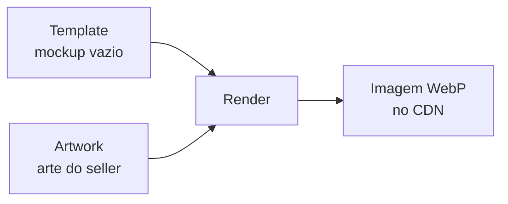
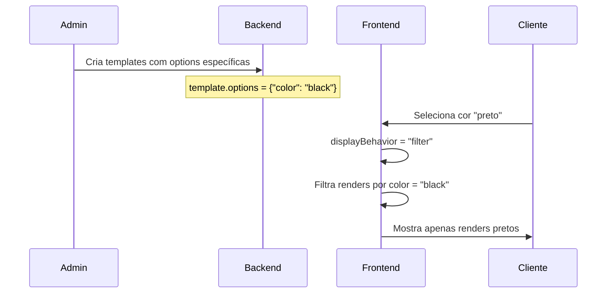
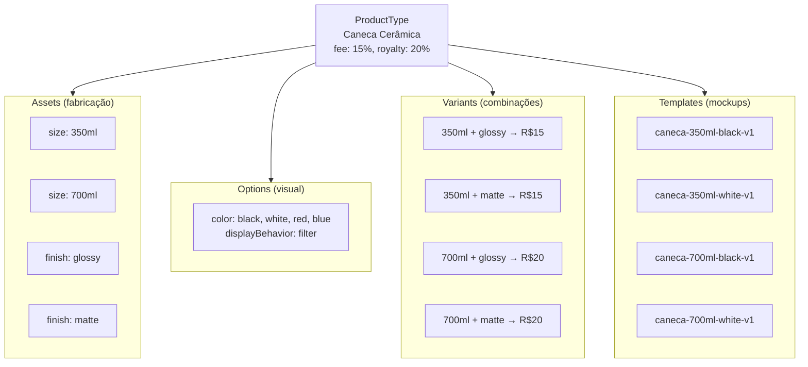

# Templates e Renders

**Templates** são mockups base (imagens de produto vazio) onde a arte do artista é composta. **Renders** são o resultado final — a arte aplicada no template.

## Conceito



- **Template** = foto de uma caneca vazia, por exemplo
  - Tem `assets` obrigatórios: quais assets ele representa
  - Tem `options` opcionais: se `null`, funciona para qualquer option
- **Render** = resultado final (arte aplicada no template)
  - Herda `assets` e `options` do template

## Match por subset

O match entre template e variante é por **subset** — o template casa com qualquer variante que **contenha** todos os assets do template.

| Template `assets` | Casa com quais variantes |
|---|---|
| `{}` (vazio) | **Todas** as variantes do ProductType |
| `{"size": "350ml"}` | Variantes que têm `size=350ml` (qualquer finish) |
| `{"size": "350ml", "finish": "glossy"}` | Só variantes `350ml + glossy` |

### Combinando com options

| `assets` | `options` | Quando aparece na loja |
|---|---|---|
| `{}` | `null` | **Sempre**, para qualquer variante e qualquer cor |
| `{}` | `{"color": "black"}` | Qualquer variante, só quando cor = preto |
| `{"size": "350ml"}` | `null` | Variantes 350ml, qualquer cor |
| `{"size": "350ml"}` | `{"color": "black"}` | Variantes 350ml, só cor preta |

## Quando NÃO colocar um asset no template

Se o asset afeta o preço/fabricação mas **não muda a foto do mockup**, ele não deve ir no template.

:::tip Regra prática
Olhe para a foto do mockup. Se você não consegue distinguir visualmente entre dois valores de um asset (ex: glossy vs matte na foto), **não inclua esse asset no template**.
:::

**Exemplo:** O asset `finish` (glossy/matte) afeta o preço, mas a foto é visualmente igual. O template usa `assets: {"size": "350ml"}` sem `finish`, e casa com **ambas** as variantes (glossy e matte).

## Regras de options

| Valor de `options` | Comportamento |
|---|---|
| `null` | Template funciona para **qualquer** combinação de options |
| `{"color": "black"}` | Template **só aparece** quando o cliente selecionar cor preta |

:::warning
Toda key:value em `options` é validada contra as options cadastradas no ProductType. Keys inexistentes retornam **erro 400**.
:::

## Como `options` se relaciona com `displayBehavior`

São conceitos complementares em camadas diferentes:

| Conceito | Onde vive | Quem usa | O que faz |
| --- | --- | --- | --- |
| `template.options` | Template | **Backend** | Define _para qual valor_ este mockup foi criado |
| `displayBehavior` | ProductTypeOption | **Frontend** | Define _como a galeria reage_ à seleção |



## Múltiplos renders por option

É possível ter mais de um template com os mesmos assets e options — útil para mostrar **diferentes ângulos**:

```
Template "caneca-350ml-preta-frente-v1"
├── assets: {"size": "350ml"}
├── options: {"color": "black"}
└── base image: foto frontal

Template "caneca-350ml-preta-lateral-v1"
├── assets: {"size": "350ml"}
├── options: {"color": "black"}
└── base image: foto lateral
```

O comprador seleciona `color: black` → galeria mostra **ambas** as imagens (frente e lateral).

## Por que o ID é texto?

O template usa um **ID semântico legível** (ex: `caneca-350ml-black-v1`) em vez de UUID:

- Facilita debug nos logs e S3
- Paths legíveis: `templates/caneca-350ml-black-v1/base.png`
- Versionamento: sufixo `-v1`, `-v2`

Se não enviar `id`, é auto-gerado a partir do `displayName`.

## Hierarquia completa



---

## Regras rápidas

- Match por **subset** — template casa se seus assets estão contidos nos da variant
- `assets: {}` casa com **todas** as variantes
- `options: null` funciona para **qualquer** option
- Se o asset não muda o mockup visualmente → **não incluir** no template
- Toda key:value em `options` é **validada** contra options cadastradas
- `template.options` define para qual valor o mockup foi criado (backend)
- `displayBehavior` define como a galeria reage à seleção (frontend)
- Renders genéricos (`options: null`) **sempre aparecem** na galeria
- ID é texto semântico legível (não UUID) — facilita debug e S3
