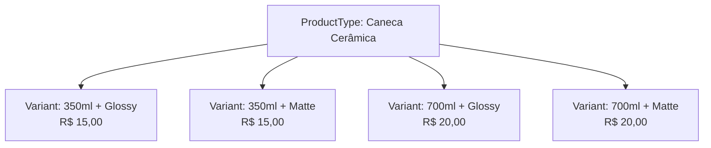
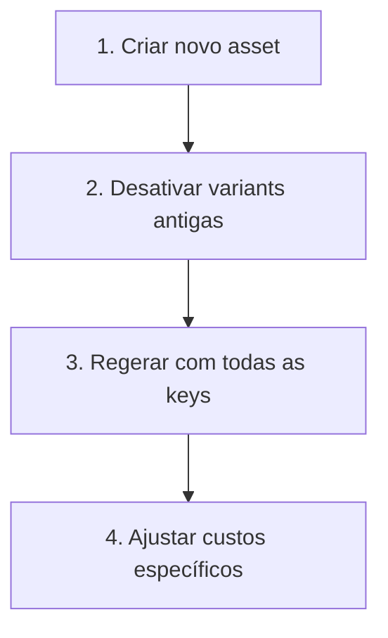
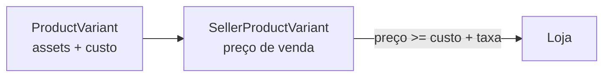

# Variants

Uma **ProductVariant** é uma combinação única de assets com seu próprio custo de produção. Variants definem **o que será fabricado** e por quanto.

## Conceito



Cada variant é identificada pelo seu **dict de assets**:

```json
{
  "assets": { "size": "350ml", "finish": "glossy" },
  "baseCostCents": 1500,
  "sku": "CANECA-350-GLOSSY",
  "productionDays": 3,
  "packagingDays": 1
}
```

## Regras importantes

:::warning
- Variants contêm **apenas assets**, nunca options
- Cada combinação de assets deve ser **única** por ProductType
- O dict é comparado por **igualdade exata** — `{size: "350ml"}` ≠ `{size: "350ml", finish: "glossy"}`
:::

## Geração automática (produto cartesiano)

O endpoint `generate-variants` calcula **todas as combinações possíveis** de assets ativos:

| Assets cadastrados | Combinações geradas |
| --- | --- |
| `size: [350ml, 700ml]` + `finish: [glossy, matte]` | 2 x 2 = **4 variants** |
| `size: [350ml, 700ml]` + `finish: [glossy, matte]` + `material: [ceramic, porcelain]` | 2 x 2 x 2 = **8 variants** |

:::info
O cartesiano é **sempre de todas as keys**. Combinações parciais nunca são geradas.
:::

### SKU auto-gerado

O SKU é criado no formato `{SLUG}-{VALORES}`:
- Product type: `caneca-ceramica`
- Assets: `{finish: "glossy", size: "350ml"}`
- SKU: `CANECA-CERAMICA-GLOSSY-350ML`

## Adicionando nova key de asset

Quando você adiciona uma nova key a um product type que já tem variants, o `generate-variants` gera **novas variants com todas as keys**. As antigas com menos keys continuam existindo.

**Fluxo correto:**



1. `POST /products/types/{id}/assets` — criar novo asset
2. `DELETE /products/types/{id}/variants/bulk` — desativar variants antigas
3. `POST /products/types/{id}/generate-variants` — regerar
4. `PATCH /products/types/{id}/variants/bulk` — ajustar custos

## Relação com SellerProduct

O **Seller** referencia variants do catálogo ao criar seu produto:



Cada `SellerProductVariant` tem:
- `productVariantId` — referência à variant do catálogo
- `priceCents` — preço de venda definido pelo seller
- `allowedOptions` — quais options o comprador pode escolher

---

## Regras rápidas

- Variants contêm **apenas assets**, nunca options
- Cada combinação de assets deve ser **única** por ProductType
- Dict comparado por **igualdade exata**
- `generate-variants` usa **todas** as keys ativas (produto cartesiano completo)
- Combinações parciais **nunca** são geradas
- Preço do seller deve ser `> baseCostCents + platformFee`
- Ao adicionar nova key, desative variants antigas antes de regerar
