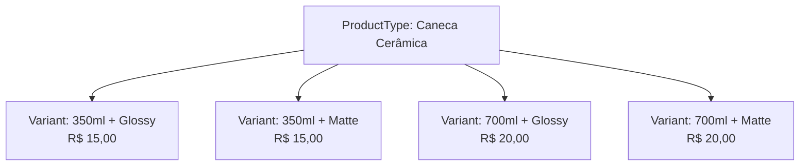
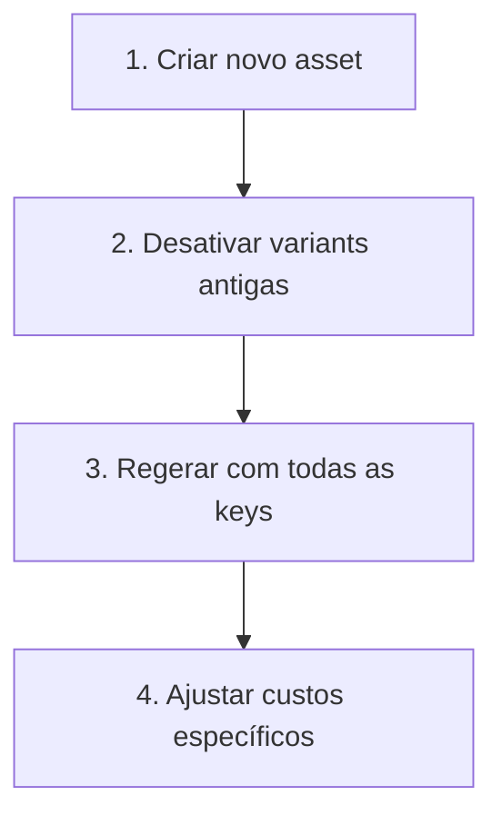
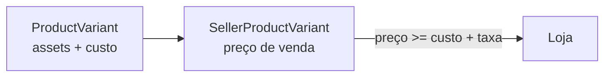

# Variants

Uma **ProductVariant** é uma combinação única de assets com seu próprio custo de produção. Variants definem **o que será fabricado** e por quanto.

## Conceito


```mermaid
graph TD
    PT[ProductType: Caneca Cerâmica]
    PT --> V1["Variant: 350ml + Glossy<br/>R$ 15,00"]
    PT --> V2["Variant: 350ml + Matte<br/>R$ 15,00"]
    PT --> V3["Variant: 700ml + Glossy<br/>R$ 20,00"]
    PT --> V4["Variant: 700ml + Matte<br/>R$ 20,00"]
```

Cada variant é identificada pelo seu **dict de assets**, resolvido automaticamente a partir dos IDs enviados.

**Payload de criação** — envie os **IDs** dos assets (não o dict):

```json
{
  "assetIds": ["uuid-asset-size-350ml", "uuid-asset-finish-glossy"],
  "baseCostCents": 1500,
  "sku": "CANECA-350-GLOSSY",
  "productionDays": 3,
  "packagingDays": 1
}
```

<details>
<summary>Response — o dict `assets` vem resolvido</summary>

```json
{
  "id": "uuid-variant",
  "productTypeId": "uuid-product-type",
  "assets": { "size": "350ml", "finish": "glossy" },
  "baseCostCents": 1500,
  "sku": "CANECA-350-GLOSSY",
  "productionDays": 3,
  "packagingDays": 1,
  "isActive": true
}
```

</details>

:::tip Por que `assetIds` no request e `assets` na response?
O admin **envia IDs** (seguro, imutáveis). O servidor resolve e **retorna o dict** (útil para o frontend). Se você enviar o dict direto no request, a API retorna `422`.
:::

**Validações automáticas:**

| Erro | HTTP |
|---|---|
| Asset ID não existe | 400 |
| Asset de outro product type | 400 |
| Asset inativo | 400 |
| Dois assets com a mesma key (ex: `size=350ml` + `size=700ml`) | 400 |
| ID duplicado na lista | 400 |
| Combinação já existe | 409 |

## Regras importantes

:::warning
- Variants contêm **apenas assets**, nunca options
- Cada combinação de assets deve ser **única** por ProductType
- O dict é comparado por **igualdade exata** — `{size: "350ml"}` ≠ `{size: "350ml", finish: "glossy"}`
:::

## Geração automática (produto cartesiano)

O endpoint `generate-variants` calcula **todas as combinações possíveis** de assets ativos:

| Assets cadastrados | Combinações geradas |
| --- | --- |
| `size: [350ml, 700ml]` + `finish: [glossy, matte]` | 2 x 2 = **4 variants** |
| `size: [350ml, 700ml]` + `finish: [glossy, matte]` + `material: [ceramic, porcelain]` | 2 x 2 x 2 = **8 variants** |

:::info
O cartesiano é **sempre de todas as keys**. Combinações parciais nunca são geradas.
:::

### SKU auto-gerado

O SKU é criado no formato `{SLUG}-{VALORES}`, com os valores ordenados por **key alfabética** e em **uppercase**:
- Product type: `caneca-ceramica`
- Assets: `{finish: "glossy", size: "350ml"}` (ordem alfabética: `finish` antes de `size`)
- SKU: `CANECA-CERAMICA-GLOSSY-350ML`

:::info Response do `generate-variants`
Retorna `{ created, skipped, totalCombinations }`. Combinações que já existem caem em `skipped` (sem erro). O SKU pode ser sobrescrito depois via bulk update.
:::

## Criação bulk (manual)

Diferente do `generate-variants` (cartesiano automático), o bulk manual permite criar **subconjuntos específicos** de combinações com custos diferentes por variant:

```http
POST /products/types/{productTypeId}/variants/bulk
```

```json
{
  "variants": [
    { "assetIds": ["uuid-size-350ml", "uuid-finish-glossy"], "baseCostCents": 1500, "sku": "CANECA-350-GLOSSY" },
    { "assetIds": ["uuid-size-700ml", "uuid-finish-glossy"], "baseCostCents": 2200, "sku": "CANECA-700-GLOSSY" }
  ]
}
```

Cada item é validado independentemente. Response retorna `{ created, skipped, errors }`.

## Deleção bulk

```http
DELETE /products/types/{productTypeId}/variants/bulk
```

```json
{ "variantIds": ["uuid-1", "uuid-2"] }
```

- Soft delete (marca `isActive: false`)
- O SKU é setado como `null` ao desativar (libera o valor para reuso)
- **Idempotente** — re-deletar uma variant já desativada não causa erro

## Adicionando nova key de asset

Quando você adiciona uma nova key a um product type que já tem variants, o `generate-variants` gera **novas variants com todas as keys**. As antigas com menos keys continuam existindo.

**Fluxo correto:**


```mermaid
graph TD
    A[1. Criar novo asset] --> B[2. Desativar variants antigas]
    B --> C[3. Regerar com todas as keys]
    C --> D[4. Ajustar custos específicos]
```

1. `POST /products/types/{id}/assets` — criar novo asset
2. `DELETE /products/types/{id}/variants/bulk` — desativar variants antigas (body: `{ "variantIds": [...] }`)
3. `POST /products/types/{id}/generate-variants` — regerar com todas as keys
4. `PATCH /products/types/{id}/variants/bulk` — ajustar custos específicos

## Relação com SellerProduct

O **Seller** referencia variants do catálogo ao criar seu produto:


```mermaid
graph LR
    PV[ProductVariant<br/>assets + custo] --> SPV[SellerProductVariant<br/>preço de venda]
    SPV --> |"preço >= custo + taxa"| Loja
```

Cada `SellerProductVariant` tem:
- `productVariantId` — referência à variant do catálogo
- `priceCents` — preço de venda definido pelo seller
- `allowedOptions` — quais options o comprador pode escolher

---

## Regras rápidas

- Variants contêm **apenas assets**, nunca options
- Cada combinação de assets deve ser **única** por ProductType
- Dict comparado por **igualdade exata**
- `generate-variants` usa **todas** as keys ativas (produto cartesiano completo)
- Combinações parciais **nunca** são geradas
- Preço do seller deve ser `> baseCostCents + platformFee`
- Ao adicionar nova key, desative variants antigas antes de regerar
