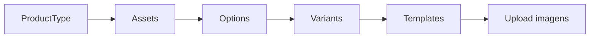

# Guia do Admin — Configurar Catálogo

Guia completo para configurar um produto do zero. Este fluxo é **exclusivo para admins** — sellers não têm acesso a estes endpoints.

## Visão geral do fluxo



:::info Padrão de endpoints
- **Criação/Listagem:** aninhado sob o product type → `POST /products/types/{id}/recurso`
- **CRUD individual:** flat com ID → `GET/PATCH/DELETE /products/recurso/{id}`
:::

---

## Passo 1: Criar ProductType

```http
POST /products/types
```

```json
{
  "slug": "caneca-ceramica",
  "name": "Caneca Cerâmica",
  "description": "Caneca de cerâmica personalizada",
  "platformFeePercent": 15,
  "artistRoyaltyPercent": 20
}
```

**Validações do slug:**
- Apenas letras minúsculas, números e hífens (`^[a-z0-9-]+$`)
- Entre 1 e 50 caracteres
- Deve ser **único** — a API retorna 400 se já existir

<details>
<summary>Response</summary>

```json
{
  "id": "uuid-product-type",
  "slug": "caneca-ceramica",
  "name": "Caneca Cerâmica",
  "description": "Caneca de cerâmica personalizada",
  "platformFeePercent": 15,
  "artistRoyaltyPercent": 20,
  "isActive": true,
  "createdAt": "2026-03-12T00:00:00Z"
}
```

</details>

#### Atualizar ProductType

```http
PATCH /products/types/{product_type_id}
```

```json
{
  "artistRoyaltyPercent": 30,
  "platformFeePercent": 20
}
```

Envie apenas os campos que deseja alterar.

---

## Passo 2: Criar Assets

Assets são as características estruturais. Cada par key/value é um registro separado.

```http
POST /products/types/{product_type_id}/assets/bulk
```

```json
{
  "assets": [
    { "key": "size", "keyLabelPt": "Tamanho", "keyLabelEn": "Size", "value": "350ml", "labelPt": "350ml", "labelEn": "350ml" },
    { "key": "size", "keyLabelPt": "Tamanho", "keyLabelEn": "Size", "value": "700ml", "labelPt": "700ml", "labelEn": "700ml" },
    { "key": "finish", "keyLabelPt": "Acabamento", "keyLabelEn": "Finish", "value": "glossy", "labelPt": "Brilhante", "labelEn": "Glossy" },
    { "key": "finish", "keyLabelPt": "Acabamento", "keyLabelEn": "Finish", "value": "matte", "labelPt": "Fosco", "labelEn": "Matte" }
  ]
}
```

| Campo | Obrigatório | Descrição |
|---|---|---|
| `key` | Sim | Chave do grupo (ex: `size`, `finish`) |
| `keyLabelPt` | Não | Label do grupo em pt-BR. Aparece como **título do seletor** no frontend |
| `keyLabelEn` | Não | Label do grupo em inglês |
| `value` | Sim | Valor do asset (ex: `350ml`, `glossy`) |
| `labelPt` | Sim | Label do valor em pt-BR |
| `labelEn` | Não | Label do valor em inglês |

:::tip
`keyLabelPt` é o que aparece como título do seletor no frontend. Ex: "Tamanho" acima dos botões 350ml / 700ml. Recomenda-se sempre preencher.
:::

**Outros endpoints:**

```
GET    /products/types/{productTypeId}/assets     — listar
PATCH  /products/assets/{assetId}                 — atualizar
DELETE /products/assets/{assetId}                 — desativar (soft delete)
```

---

## Passo 3: Criar Options (com Values)

Options são características visuais com múltiplos values.

```http
POST /products/types/{product_type_id}/options
```

```json
{
  "key": "color",
  "labelPt": "Cor",
  "labelEn": "Color",
  "inputType": "color_picker",
  "displayBehavior": "filter",
  "required": true,
  "values": [
    { "value": "black", "labelPt": "Preto", "labelEn": "Black", "hexColor": "#000000" },
    { "value": "white", "labelPt": "Branco", "labelEn": "White", "hexColor": "#FFFFFF" },
    { "value": "red", "labelPt": "Vermelho", "labelEn": "Red", "hexColor": "#FF0000" }
  ]
}
```

#### Adicionar value a option existente

```http
POST /products/options/{optionId}/values
```

```json
{
  "value": "blue",
  "labelPt": "Azul",
  "labelEn": "Blue",
  "hexColor": "#0000FF"
}
```

#### Atualizar option (metadata)

```http
PATCH /products/options/{optionId}
```

```json
{
  "labelPt": "Cor do Produto",
  "displayBehavior": "show_all"
}
```

:::info
O campo `key` é **imutável** após criação.
:::

**Outros endpoints:**

```
GET    /products/types/{productTypeId}/options     — listar
DELETE /products/options/{optionId}                 — desativar option
DELETE /products/option-values/{valueId}            — desativar value
PATCH  /products/option-values/{valueId}            — atualizar value
```

---

## Passo 4: Criar Variants

### Geração automática (recomendado)

```http
POST /products/types/{product_type_id}/generate-variants
```

```json
{
  "baseCostCents": 1500,
  "productionDays": 3,
  "packagingDays": 1
}
```

Gera o **produto cartesiano** de todos os assets ativos. Com `size: [350ml, 700ml]` e `finish: [glossy, matte]` → **4 variants**.

### Ajustar custos com bulk update

```http
PATCH /products/types/{product_type_id}/variants/bulk
```

```json
{
  "variants": [
    { "id": "uuid-700ml-glossy", "baseCostCents": 2000 },
    { "id": "uuid-700ml-matte", "baseCostCents": 2000 }
  ]
}
```

### Criação manual (quando necessário)

```http
POST /products/types/{product_type_id}/variants
```

```json
{
  "assetIds": ["uuid-asset-size-350ml", "uuid-asset-finish-glossy"],
  "baseCostCents": 1500,
  "sku": "CANECA-350-GLOSSY",
  "productionDays": 3,
  "packagingDays": 1
}
```

:::warning Validações automáticas
| Erro | HTTP |
| --- | --- |
| Asset ID não existe | 400 |
| Asset de outro product type | 400 |
| Asset inativo | 400 |
| Dois assets com mesma key | 400 |
| Combinação já existe | 409 |
:::

**Outros endpoints:**

```
GET    /products/types/{productTypeId}/variants    — listar
GET    /products/variants/{id}                     — obter por ID
PATCH  /products/variants/{variantId}              — atualizar
DELETE /products/variants/{id}                     — desativar (soft delete)
DELETE /products/types/{id}/variants/bulk           — desativar em lote
```

---

## Passo 5: Criar Templates

```http
POST /products/types/{productTypeId}/templates
```

```json
{
  "displayName": "Caneca 350ml Preta",
  "assets": { "size": "350ml" },
  "options": { "color": "black" },
  "config": {
    "printArea": { "x": 100, "y": 50, "width": 400, "height": 300 },
    "sourceImage": { "width": 1000, "height": 800 }
  }
}
```

| Campo | Obrigatório | Descrição |
| --- | --- | --- |
| `displayName` | Sim | Nome legível |
| `id` | Não | Auto-gerado a partir do displayName se omitido |
| `assets` | Sim (aceita `{}`) | Dict de assets. `{}` = todas as variantes |
| `options` | Não | Dict de options ou `null` |
| `config` | Não | Configuração de posicionamento da arte |
| `isActive` | Não | Default: `false`. Ativado ao fazer upload da base |

Depois de criar o template, faça o [upload da imagem base](/docs/flows/image-upload).

**Outros endpoints:**

```
GET    /products/types/{productTypeId}/templates              — listar (ativos)
GET    /products/templates/admin/all                          — listar todos (admin)
GET    /products/templates/{templateId}                       — obter por ID
PATCH  /products/templates/{templateId}                       — atualizar
DELETE /products/templates/{templateId}                       — desativar
GET    /products/templates/{templateId}/preview               — preview com printArea
POST   /products/templates/{templateId}/preview-placement     — preview com artwork
POST   /products/templates/{templateId}/test-render           — render de teste
```

---

## Exemplo completo: Caneca do zero

```
1. POST /products/types
   → "Caneca Cerâmica" (fee: 15%, royalty: 20%)

2. POST /products/types/{id}/assets/bulk
   → size: 350ml, 700ml | finish: glossy, matte

3. POST /products/types/{id}/options
   → color: black, white, red, blue (filter, color_picker)

4. POST /products/types/{id}/generate-variants
   → Gera 4 variants (2 x 2), baseCostCents: 1500

5. PATCH /products/types/{id}/variants/bulk
   → Ajusta 700ml para baseCostCents: 2000

6. POST /products/types/{id}/templates (x8)
   → 1 por cor × 1 por tamanho
   → finish NÃO vai em assets do template

7. Para cada template: presign → PUT S3 → complete
```
