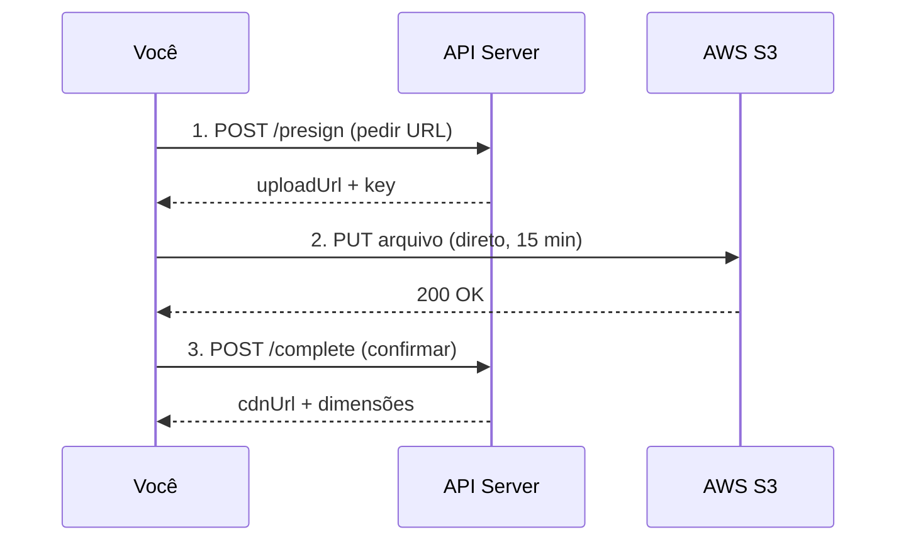

# Upload de Imagens (Presign Flow)

As imagens **não passam pelo servidor da API**. O upload vai direto do seu computador para o S3 da AWS via presigned URL.

:::info Quem usa este fluxo?
- **Admin** — upload de imagens base para templates (mockups)
- **Seller** — upload de artworks (artes)
:::

## Como funciona



### O que é uma Presigned URL?

Uma URL temporária gerada pelo servidor que dá permissão para upload direto no S3, **sem credenciais da AWS**:

1. Servidor gera URL com assinatura criptográfica
2. URL permite **exatamente uma operação** (PUT de um arquivo específico)
3. **Expira em 15 minutos**

---

## Upload de Template

### Etapa 1: Presign

```http
POST /products/templates/{templateId}/images/presign
```

```json
{
  "kind": "base",
  "contentType": "image/png",
  "sizeBytes": 1048576
}
```

| Campo | Descrição |
| --- | --- |
| `kind` | Tipo da imagem (ver tabela abaixo) |
| `contentType` | MIME type do arquivo |
| `sizeBytes` | Tamanho em bytes |

**Kinds disponíveis:**

| Kind | Obrigatório | Descrição |
| --- | --- | --- |
| `base` | **Sim** | Imagem principal do mockup |
| `mask` | Não | Máscara da área de impressão |
| `outline` | Não | Contorno do produto |
| `shadow` | Não | Sombra (blend multiply) |
| `highlight` | Não | Brilho/reflexo (blend screen) |
| `preview` | Não | Thumbnail |

**Formatos aceitos:**

| Extensão | Content-Type | Recomendado para |
| --- | --- | --- |
| `.png` | `image/png` | Imagens com transparência (RGBA) |
| `.jpg`/`.jpeg` | `image/jpeg` | Fotos sem transparência |
| `.webp` | `image/webp` | Fotos otimizadas |

**Tamanho máximo:** 25MB por arquivo.

<details>
<summary>Response</summary>

```json
{
  "uploadUrl": "https://s3.amazonaws.com/bucket/templates/caneca-350ml-black-v1/base.png?X-Amz-Signature=...",
  "key": "templates/caneca-350ml-black-v1/base.png",
  "kind": "base",
  "headers": { "Content-Type": "image/png" }
}
```

</details>

:::warning
Guarde o `key` — você vai precisar na Etapa 3.
:::

### Etapa 2: Upload direto no S3

Envie a imagem **diretamente para o S3** usando a `uploadUrl`:

```bash
curl -X PUT \
  "COLE_A_UPLOAD_URL_AQUI" \
  -H "Content-Type: image/png" \
  --data-binary @~/Downloads/caneca-preta.png
```

:::danger Content-Type deve ser exatamente o mesmo do presign
Se no presign mandou `image/jpeg`, aqui tem que ser `image/jpeg`. Se divergir, o S3 retorna **403 Forbidden**.
:::

**Resposta esperada:** HTTP `200 OK` com body vazio.

**Erros comuns:**

| Erro | Causa | Solução |
| --- | --- | --- |
| `403 Forbidden` | URL expirou ou Content-Type diverge | Faça presign novamente |
| `405 Method Not Allowed` | Usou POST em vez de PUT | Mude para PUT |
| `400 Bad Request` | Content-Type duplicado no header | Deixe apenas um |

### Etapa 3: Complete

```http
POST /products/templates/{templateId}/images/complete
```

```json
{
  "kind": "base",
  "key": "templates/caneca-350ml-black-v1/base.png"
}
```

<details>
<summary>Response</summary>

```json
{
  "kind": "base",
  "key": "templates/caneca-350ml-black-v1/base.png",
  "cdnUrl": "https://cdn.labanana.art/templates/caneca-350ml-black-v1/base.png",
  "widthPx": 1200,
  "heightPx": 1600
}
```

</details>

:::tip Auto-ativação
Quando você faz complete de uma imagem `base`, o template é **ativado automaticamente** (`isActive: true`).
:::

### Upload em lote (batch)

Para enviar várias imagens de uma vez:

```http
POST /products/templates/{templateId}/images/presign-batch
```

```json
{
  "images": [
    { "kind": "base", "contentType": "image/png", "sizeBytes": 1000000 },
    { "kind": "shadow", "contentType": "image/png", "sizeBytes": 500000 }
  ]
}
```

Confirmar todas de uma vez:

```http
POST /products/templates/{templateId}/images/complete-batch
```

```json
{
  "kinds": ["base", "shadow"]
}
```

---

## Upload de Artwork (Seller)

O fluxo é similar, com uma diferença: **o registro no banco só é criado no complete**.

### Etapa 1: Presign

```http
POST /uploads/artworks/presign
```

**Como seller:**

```json
{
  "contentType": "image/png",
  "sizeBytes": 2097152
}
```

**Como admin (criando para um seller):**

```json
{
  "contentType": "image/png",
  "sizeBytes": 2097152,
  "sellerProfileId": "uuid-do-seller"
}
```

### Etapa 2: Upload direto no S3

Mesmo fluxo — PUT na `uploadUrl` com Content-Type correto.

### Etapa 3: Complete

```http
POST /uploads/artworks/{artworkId}/complete
```

```json
{
  "key": "private/sellers/{sellerProfileId}/artworks/{artworkId}/original/v1.png",
  "title": "Minha Arte Abstrata"
}
```

O servidor:
1. Verifica se o arquivo existe no S3
2. Extrai dimensões, formato e hash
3. Cria o registro `Artwork` no banco
4. Gera preview WebP (max 1200px) no bucket público

### Estrutura no S3

```
private/sellers/{sellerProfileId}/artworks/{artworkId}/
├── original/
│   └── v1.png          ← original (bucket privado)
├── meta/
│   └── v1.json         ← metadados

public/sellers/{sellerProfileId}/artworks/{artworkId}/
├── preview/
│   └── v1.webp         ← preview (bucket público)
└── renders/
    └── {templateId}/
        └── v1/
            └── render.webp  ← render final
```

:::info Versionamento
O `v1` no path é a versão da arte. Se o seller atualizar, a nova versão vai para `v2.png` e novos renders para `v2/`.
:::
