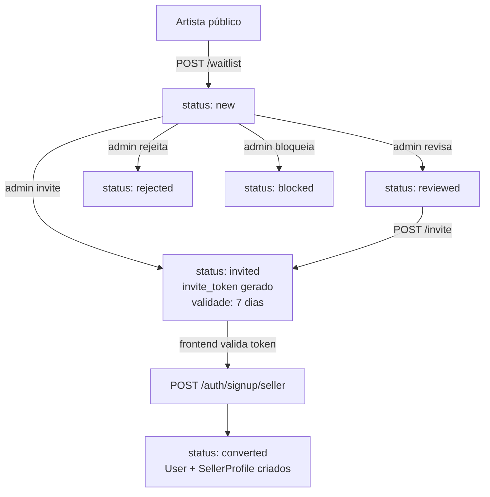

# Onboarding do Seller (Waitlist + Invite)

**Sellers não se auto-cadastram.** O fluxo é: inscrição pública → admin aprova → gera invite token → artista finaliza cadastro com o token.

## Jornada end-to-end



## Estados

| Status | Significado |
|---|---|
| `new` | Inscrito, aguardando revisão |
| `reviewed` | Admin revisou, ainda não convidou |
| `invited` | Token gerado, pode completar signup |
| `converted` | Signup completo — virou User + SellerProfile |
| `rejected` | Admin rejeitou a inscrição |
| `blocked` | Bloqueado (impede novas tentativas no email) |

## Endpoints

| Método | Rota | Auth | Descrição |
|---|---|---|---|
| `POST` | `/waitlist` | **público** | Inscrição (body: name, email, whatsapp, portfolio, consent) |
| `POST` | `/waitlist/invite/validate` | **público** | Valida token **via body** (não URL — evita vazar em logs) |
| `GET` | `/waitlist` | admin | Lista com filtro `?status_filter=...` |
| `GET` | `/waitlist/{id}` | admin | Detalhe |
| `PATCH` | `/waitlist/{id}` | admin | Muda status (ex: `new → reviewed`) |
| `POST` | `/waitlist/{id}/invite` | admin | Gera token + marca como `invited`. Só funciona se status ∈ `{new, reviewed}` |
| `POST` | `/waitlist/{id}/reject` | admin | Marca como `rejected` |
| `POST` | `/waitlist/{id}/block` | admin | Marca como `blocked` |

## 1. Inscrição pública

```http
POST /waitlist
```

```json
{
  "name": "Ana Silva",
  "email": "ana@email.com",
  "whatsapp": "+5511999999999",
  "portfolio": "https://instagram.com/atelieana",
  "artType": "illustration",
  "sellsArt": "yes",
  "goal": "extra_income",
  "consent": true
}
```

| Campo | Obrigatório | Descrição |
|---|:---:|---|
| `name` | Sim | Nome do artista |
| `email` | Sim | Email — único (não permite duplicatas ativas) |
| `whatsapp` | Sim | WhatsApp em formato E.164 |
| `portfolio` | Sim | URL (Instagram, Behance, site, etc.) |
| `artType` | Não | `illustration`, etc. |
| `sellsArt` | Não | `yes` / `no` / `sometimes` |
| `goal` | Não | `extra_income`, etc. |
| `consent` | **Sim** | `true` obrigatório (LGPD) |

## 2. Admin convida

```http
POST /waitlist/{id}/invite
```

Gera o `inviteToken` (hex, válido por **7 dias**) e muda o status para `invited`. Só funciona se o status atual é `new` ou `reviewed`.

```json
{
  "id": "uuid",
  "name": "Ana Silva",
  "email": "ana@email.com",
  "status": "invited",
  "inviteToken": "a1b2c3...hex",
  "inviteExpiresAt": "2026-04-23T12:00:00Z",
  "invitedAt": "2026-04-16T12:00:00Z",
  "convertedAt": null
}
```

**Admin entrega o link** ao artista via email ou WhatsApp:

```
{FRONTEND_URL}/signup/seller?token={inviteToken}
```

## 3. Frontend valida o token

Antes de exibir o formulário de senha, o frontend chama:

```http
POST /waitlist/invite/validate
```

```json
{ "token": "a1b2c3...hex" }
```

:::tip Token no body, não na URL
A validação envia o token **no corpo da request** (não como query param ou path). Isso evita o token vazar em logs, analytics ou referers. Replique esse padrão no frontend.
:::

Response inclui `valid: true/false` e (se válido) `email` + `name` para pré-preencher o formulário.

## 4. Signup final

```http
POST /auth/signup/seller
```

Token + senha criam o `User` com `role=seller` e o `SellerProfile` vinculado.

Comportamento do handler:

1. Valida token (não expirado, status `invited`)
2. Cria `User` com senha, `role=seller`
3. Cria `SellerProfile` (`onboarding_status=pending`, `storeStatus=unpublished`)
4. Muda waitlist para `converted`, grava `user_id` e `convertedAt`

:::info Onboarding pós-signup
O seller cai com `storeStatus=unpublished`. Para publicar a loja, ele precisa:
1. Completar `payoutComplete` (ver [Dashboard do Seller](/docs/flows/seller-dashboard#4-configuração-de-payout-pix))
2. Criar pelo menos 1 `SellerProduct` ativo
3. Mudar `storeStatus` para `published` via `PATCH /profiles/seller/me`
:::
