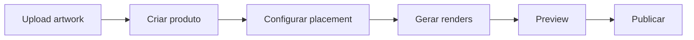
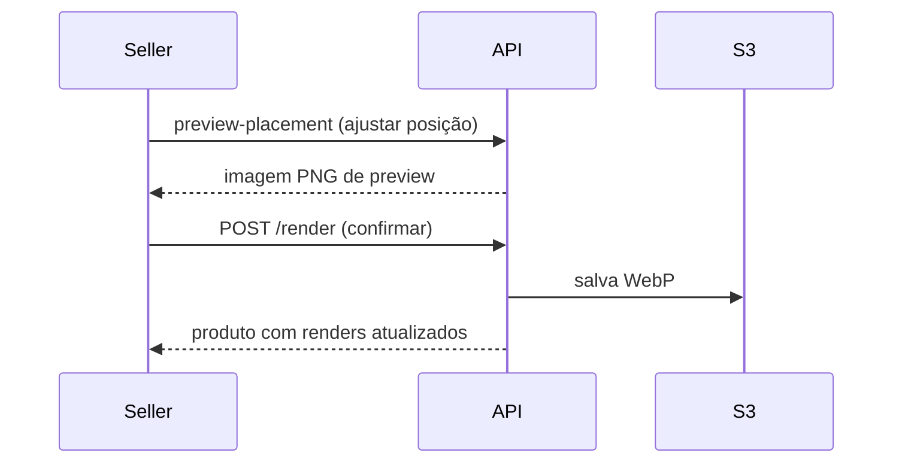

import CoordinateSystem from '@site/src/components/CoordinateSystem';

# Guia do Seller — Criar e Publicar Produto

Guia completo para um seller criar e publicar um produto. O seller trabalha **sobre o catálogo já configurado pelo admin** — ele não cria ProductTypes, Assets ou Templates.

## Visão geral



---

## Upload da artwork {#upload-da-artwork}

Use o [fluxo de presign](/docs/flows/image-upload#upload-de-artwork-seller) para fazer upload da arte.

**Endpoints:**
```
POST /uploads/artworks/presign                    — pedir URL de upload
POST /uploads/artworks/{artworkId}/complete        — confirmar e criar registro
```

---

## Criar produto {#criar-produto}

O SellerProduct é criado **já com pelo menos 1 variante**.

:::warning
A criação **NÃO** gera renders automaticamente. O seller deve configurar o placement e disparar o render explicitamente.
:::

```http
POST /seller-products/me
```

```json
{
  "productTypeId": "uuid-product-type",
  "artworkId": "uuid-artwork",
  "title": "Caneca Arte Abstrata",
  "slug": "caneca-arte-abstrata",
  "description": "Caneca com arte exclusiva",
  "variants": [
    {
      "productVariantId": "uuid-variante-350ml-glossy",
      "priceCents": 4990,
      "allowedOptions": {
        "color": ["black", "white", "red", "blue"]
      }
    },
    {
      "productVariantId": "uuid-variante-350ml-matte",
      "priceCents": 4990,
      "allowedOptions": {
        "color": ["black", "white"]
      }
    }
  ]
}
```

### Campos do produto

| Campo | Obrigatório | Descrição |
|---|---|---|
| `title` | Sim | Nome do produto |
| `slug` | Não | Slug para URL. Auto-convertido para lowercase |
| `description` | Não | Descrição do produto |

### Campos da variante

| Campo | Obrigatório | Descrição |
|---|---|---|
| `productVariantId` | Sim | UUID da ProductVariant do catálogo |
| `priceCents` | Sim | Preço de venda em centavos |
| `allowedOptions` | Não | Quais options permitir. `{}` = todas |
| `sku` | Não | SKU do seller (controle próprio) |

### Regras do allowedOptions

| Cenário | O que acontece |
|---|---|
| `{}` (vazio) | Herda **todas** as options ativas do ProductType |
| `{"color": ["black", "white"]}` | Comprador só pode escolher preto ou branco |
| `{"color": []}` | Erro 400 se `color` é required |
| `{"corErrada": ["x"]}` | Erro 400 — key não existe |
| `{"color": ["roxo"]}` | Erro 400 — value não existe |

### Adicionar variante depois

```http
POST /seller-products/me/{sellerProductId}/variants
```

```json
{
  "productVariantId": "uuid-variante-700ml-glossy",
  "priceCents": 6990,
  "allowedOptions": { "color": ["black", "blue"] }
}
```

### Criar para terceiros (admin)

```http
POST /seller-products/admin
```

Mesma lógica, mas inclui `sellerProfileId` no body.

---

## Renders {#renders}

### Conceito

O render **não é automático**. O seller decide quais templates renderizar e controla o posicionamento.



### Sistema de coordenadas

Todas as coordenadas são em **pixels do sourceImage**, com referência no **canto superior esquerdo** da arte (igual ao Figma).

<CoordinateSystem />

| Campo | Unidade | Descrição |
|---|---|---|
| `x` | px | Posição X do canto superior esquerdo da arte |
| `y` | px | Posição Y do canto superior esquerdo da arte |
| `scale` | multiplicador | `1.0` = tamanho original, `0.5` = metade |
| `rotation` | graus | Sentido horário. `0` = sem rotação |

### Pré-visualização (sem salvar) {#preview}

```http
POST /products/templates/{templateId}/preview-placement
```

```json
{
  "artworkId": "uuid-da-artwork",
  "x": 95,
  "y": 110,
  "scale": 0.14,
  "rotation": 0
}
```

Retorna **imagem PNG diretamente**. Headers de resposta indicam fit:

| Header | Descrição |
|---|---|
| `X-Fits-Within-Print-Area` | `true` ou `false` |
| `X-Overflow-Top/Right/Bottom/Left` | Overflow em pixels |
| `X-Artwork-Bounds` | Bounding box da arte (JSON) |
| `X-Print-Area-Bounds` | Retângulo da printArea (JSON) |

### Disparar render {#gerar-render}

```http
POST /seller-products/me/{sellerProductId}/render
```

```json
{
  "templateId": "caneca-350ml-preta-v1",
  "x": 95,
  "y": 110,
  "scale": 0.14,
  "rotation": 0
}
```

**O que acontece:**
1. Valida que o template existe
2. Valida que a arte cabe na printArea (tolerância de 5% de sangria)
3. Cria/atualiza o placement
4. Gera o mockup (compõe arte + layers)
5. Salva no S3 como WebP
6. Retorna o produto com todos os renders

:::tip Consistência
O preview-placement e o render usam **exatamente a mesma função** de validação. Se o preview aprova, o render aceita.
:::

---

## Publicar {#publicar}

O produto é criado com status `draft`. Para publicar:

```http
PATCH /seller-products/me/{sellerProductId}
```

```json
{ "status": "active" }
```

**Validações ao ativar:**
- Produto deve ter um `slug`
- Produto deve ter pelo menos um render

### Ciclo de vida

| Status | Visível na loja | Descrição |
|---|---|---|
| `draft` | Não | Sendo configurado (default) |
| `active` | Sim | Publicado e à venda |
| `paused` | Não | Temporariamente oculto |
| `archived` | Não | Soft delete |

### Preview antes de publicar

```http
GET /seller-products/me/{sellerProductId}/preview
```

Retorna o mesmo formato do endpoint público — funciona para **qualquer status**.

---

## Referência de endpoints

### Artwork

```
POST   /uploads/artworks/presign                    — pedir URL de upload
POST   /uploads/artworks/{artworkId}/complete        — confirmar upload
GET    /artworks/me                                  — listar minhas artes
GET    /artworks/{artworkId}                         — obter por ID
PATCH  /artworks/{artworkId}                         — atualizar
DELETE /artworks/{artworkId}                         — desativar
GET    /artworks/check-slug?slug=minha-arte          — verificar slug
GET    /artworks/{artworkId}/placements              — listar placements
PUT    /artworks/{artworkId}/placements/{templateId} — criar/atualizar placement
GET    /artworks/{artworkId}/renders                 — listar renders
POST   /artworks/{artworkId}/renders                 — gerar render (1 template)
POST   /artworks/{artworkId}/renders/batch           — gerar renders (vários)
```

### Seller Product

```
POST   /seller-products/me                                         — criar produto
GET    /seller-products/me                                         — listar meus produtos
GET    /seller-products/me/{id}                                    — obter produto
PATCH  /seller-products/me/{id}                                    — atualizar
POST   /seller-products/me/{id}/variants                           — adicionar variante
PATCH  /seller-products/me/{id}/variants/{variantId}               — atualizar variante
DELETE /seller-products/me/{id}/variants/{variantId}                — desativar variante
POST   /seller-products/me/{id}/variants/generate-skus             — gerar SKUs
POST   /seller-products/me/{id}/render                             — render template
GET    /seller-products/me/{id}/preview                            — preview página pública
DELETE /seller-products/me/{id}                                    — arquivar
```
