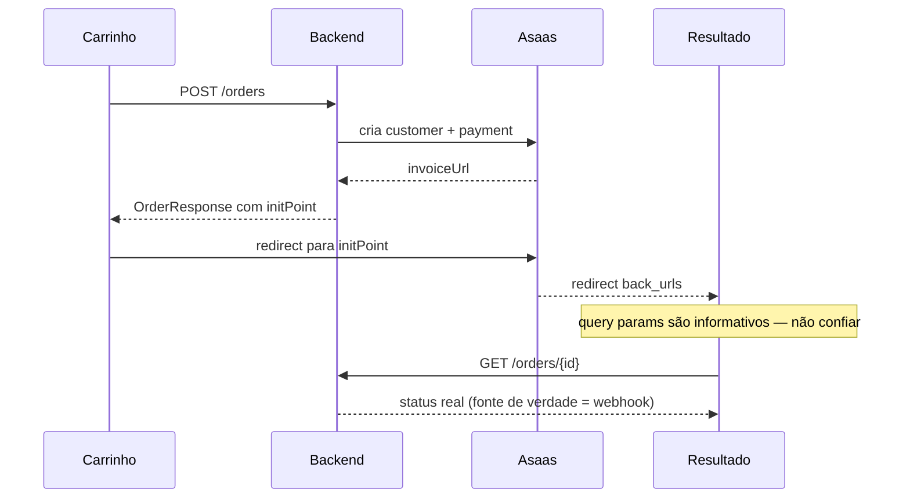

# Checkout e Pagamento

Fluxo completo de checkout via Asaas — do clique em "Finalizar compra" até a página de confirmação.

## Visão geral do fluxo



## 1. Criar o pedido

Requer autenticação. Em uma única chamada, o backend cria a order, faz snapshot de preços e cria o payment no Asaas.

```typescript
const response = await fetch('/orders', {
  method: 'POST',
  headers: {
    Authorization: `Bearer ${accessToken}`,
    'Content-Type': 'application/json',
  },
  body: JSON.stringify({
    // fullName e phone são opcionais — se omitidos, usa dados do user logado
    fullName: recipientName || undefined,   // entrega em nome de outra pessoa
    phone: recipientPhone || undefined,
    shipping: {
      cep: '01310100',
      street: 'Av Paulista',
      number: '1000',
      complement: 'Apto 42',
      neighborhood: 'Bela Vista',
      city: 'São Paulo',
      state: 'SP',
    },
    items: cart.items.map((item) => ({
      sellerProductId: item.sellerProductId,
      variantId: item.variantId,              // SellerProductVariant ID (SKU)
      quantity: item.quantity,
      selectedOptions: item.selectedOptions,  // ex: { color: "black" }
    })),
    shippingCents: shippingQuote.priceCents,
    discountCents: 0,
    shippingMethodId: shippingQuote.methodId,
    carrier: shippingQuote.carrier,
    serviceCode: shippingQuote.serviceCode,
  }),
});

const order = await response.json();

// Redirecionar para o Asaas
if (order.initPoint) {
  window.location.href = order.initPoint;
}
```

**Campos importantes no response:**

- `order.id` — salvar para consultar depois
- `order.initPoint` — URL para redirecionar ao Asaas
- `order.payment.status` — deve ser `"pending"`

:::info O que NÃO vai no body
- **`email`** — sempre do usuário autenticado
- **`fullName`** — se omitido, usa `user.name`. Se enviado, é o nome do **destinatário da entrega**
- **`phone`** — se omitido, usa `user.whatsapp`
:::

:::danger CPF/CNPJ obrigatório
Se o usuário não tem `documentNumber`, este endpoint retorna erro. Antes do checkout, verificar `GET /auth/me` e coletar via `PATCH /users/me` se necessário. Ver [Atualizar Perfil](/docs/api-reference/auth#atualizar-perfil).
:::

## 2. Redirect para Asaas

Após criar o pedido, redirecionar imediatamente. O `initPoint` já vem pronto — sandbox em dev, produção em prod.

```typescript
window.location.href = order.initPoint;
```

O cliente sai do site, paga no Asaas, e volta via `back_urls`.

## 3. Páginas de resultado (`back_urls`)

O Asaas redireciona o cliente para o frontend com query params. São necessárias **3 rotas**:

| Rota | Quando |
|---|---|
| `/order/success` | Pagamento aprovado |
| `/order/failure` | Pagamento rejeitado |
| `/order/pending` | Em processamento (Pix, boleto) |

### Query params recebidos

```typescript
const params = new URLSearchParams(window.location.search);

const externalReference = params.get('external_reference'); // UUID da order
const paymentId         = params.get('payment_id');
const status            = params.get('status');         // "approved", "rejected", "pending"
const paymentType       = params.get('payment_type');   // "credit_card", "pix", etc.
const merchantOrderId   = params.get('merchant_order_id');
const preferenceId      = params.get('preference_id');
```

:::danger Não confiar nos query params!
Os query params são **informativos** — o usuário pode alterar a URL manualmente. A **fonte de verdade** é o backend (atualizado via webhook).

```typescript
// ERRADO
if (params.get('status') === 'approved') showSuccess();

// CORRETO — sempre consultar o backend
const order = await api.getOrder(params.get('external_reference'));
if (order.paymentStatus === 'approved') showSuccess();
```
:::

## 4. Página de sucesso (`/order/success`)

**Quando:** `order.paymentStatus === "approved"`.

Como o webhook é assíncrono, **pode demorar 1-2s** para o status real chegar. Implemente polling:

```typescript
async function waitForPaymentConfirmation(orderId: string, maxAttempts = 10) {
  for (let i = 0; i < maxAttempts; i++) {
    const order = await api.getOrder(orderId);
    if (order.paymentStatus !== 'pending') {
      return order;
    }
    await new Promise((resolve) => setTimeout(resolve, 2000)); // 2s
  }
  return null; // timeout — mostrar "verificando pagamento"
}
```

**O que exibir:**

- Confirmação visual de pagamento aprovado
- Número do pedido: `order.orderNumber` (ex: `#1023`)
- Resumo dos itens comprados (com thumbs)
- Endereço de entrega
- Valor total pago
- Previsão de entrega: `productionDays + packagingDays + shipment.etaDays` dias úteis
- Link para "Meus Pedidos"

### GA4 — evento `purchase`

```typescript
if (order.paymentStatus === 'approved') {
  gtag('event', 'purchase', {
    transaction_id: order.id,
    value: order.totalCents / 100,
    currency: 'BRL',
    shipping: order.shippingCents / 100,
    items: order.items.map((item, index) => ({
      item_id: item.sellerProductId,
      item_name: item.title,
      item_category: item.productTypeName,
      item_variant: item.optionLabel,
      item_brand: item.sellerName,
      price: item.unitPriceCents / 100,
      quantity: item.quantity,
      index,
    })),
  });
}
```

:::tip Idempotência
Use `order.id` como `transaction_id`. O GA4 dedupe purchases com mesmo ID — se o usuário der F5, o evento não é duplicado.
:::

## 5. Página de falha (`/order/failure`)

**Quando:** `order.paymentStatus === "rejected"`.

**Exibir:**
- Mensagem de pagamento não aprovado
- Motivo (se disponível — ver tabela de `status_detail` abaixo)
- Botão **"Tentar novamente"**

### Retry de pagamento

```typescript
const orderId = params.get('external_reference');
const order = await api.getOrder(orderId);

// O initPoint é reconstruído automaticamente para orders pending/rejected
if (order.initPoint) {
  retryButton.onclick = () => {
    window.location.href = order.initPoint;
  };
}

// Se initPoint estiver null (preference expirou), gerar novo via POST /pay
if (!order.initPoint && ['pending', 'rejected'].includes(order.paymentStatus)) {
  const payResponse = await fetch(`/orders/${orderId}/pay`, {
    method: 'POST',
    headers: { Authorization: `Bearer ${accessToken}` },
  });
  const payData = await payResponse.json();
  window.location.href = payData.initPoint;
}
```

### Mensagens por motivo de rejeição

| `status_detail` | Mensagem sugerida |
|---|---|
| `cc_rejected_bad_filled_security_code` | "Código de segurança incorreto. Verifique o CVV." |
| `cc_rejected_bad_filled_date` | "Data de validade incorreta." |
| `cc_rejected_bad_filled_other` | "Verifique os dados do cartão." |
| `cc_rejected_insufficient_amount` | "Saldo insuficiente. Tente outro cartão." |
| `cc_rejected_other_reason` | "Pagamento recusado. Tente outro meio de pagamento." |
| `cc_rejected_call_for_authorize` | "Ligue para a operadora do cartão para autorizar." |
| `cc_rejected_duplicated_payment` | "Pagamento duplicado detectado." |
| `cc_rejected_max_attempts` | "Limite de tentativas. Tente mais tarde." |
| (outros) | "Não foi possível processar o pagamento. Tente novamente." |

## 6. Página de pendente (`/order/pending`)

**Quando:** `order.paymentStatus === "pending"` após pagamento via Pix ou boleto.

**Exibir:**
- Mensagem de "pagamento em processamento"
- Se Pix: QR code ou código copia-e-cola
- Se boleto: link para o boleto
- Link para "Meus Pedidos"

Aplicar o mesmo padrão de polling da página de sucesso. Quando `paymentStatus` mudar para `approved`, redirecionar para `/order/success`:

```typescript
const order = await waitForPaymentConfirmation(orderId);
if (order?.paymentStatus === 'approved') {
  router.push(`/order/success?external_reference=${orderId}`);
}
```

## 7. Listagem "Meus Pedidos"

```typescript
const orders = await fetch('/orders/me?limit=20', {
  headers: { Authorization: `Bearer ${accessToken}` },
}).then((r) => r.json());

// orders.orders[] — array de OrderResponse
// orders.total — total para paginação
```

Para cada order exibir:

- `orderNumber` (`#1023`)
- Badges de `paymentStatus` e `fulfillmentStatus` (ver [Status e Tracking](/docs/frontend/status-and-tracking))
- `totalCents / 100` formatado
- `createdAt`
- Thumbnail: `items[0].imageUrl`

## 8. Detalhe do pedido

```typescript
const order = await api.getOrder(orderId);
```

**Blocos a exibir:**

| Bloco | Conteúdo |
|---|---|
| **Header** | `orderNumber`, `createdAt`, badges de status |
| **Itens** | Para cada `order.items[]`: `imageUrl`, `title`, `optionLabel`, `sellerName`, qty × `unitPriceCents`, fulfillment individual, tracking |
| **Endereço** | `shippingStreet`, `shippingNumber`, `shippingComplement`, `shippingNeighborhood`, `shippingCity`-`shippingState`, `shippingCep` |
| **Pagamento** | `payment.paymentProvider`, `payment.status`, `payment.amountCents / 100`, `payment.paidAt` |
| **Frete** | `shipment.label` (ex: "PAC - Correios"), `shipment.priceCents / 100`, `shipment.trackingCode`, `shipment.status` |

**Ações por estado:**

- `paymentStatus` em `pending`/`rejected` → Botão "Pagar" (redireciona para `initPoint`)
- `paymentStatus === 'approved'` e `shipment.trackingCode` disponível → Link de rastreio

## 9. Telas necessárias — resumo

| Tela | Rota | Descrição |
|---|---|---|
| Checkout | (botão no carrinho) | `POST /orders` + redirect `initPoint` |
| Sucesso | `/order/success` | Confirmação de pagamento aprovado |
| Falha | `/order/failure` | Pagamento rejeitado + retry |
| Pendente | `/order/pending` | Processamento (Pix/boleto) |
| Meus Pedidos | `/orders` ou `/account/orders` | Listagem com status |
| Detalhe | `/orders/{id}` | Detalhes + tracking |

## 10. Checklist de implementação

**Checkout**
- [ ] "Finalizar compra" chama `POST /orders`
- [ ] Verifica `user.documentNumber` antes — se faltar, abre modal de CPF/CNPJ e chama `PATCH /users/me`
- [ ] Redireciona para `initPoint` após sucesso
- [ ] Trata erro (exibe mensagem se order falhar)

**Páginas de resultado**
- [ ] `/order/success` — consulta `GET /orders/{id}`, exibe confirmação
- [ ] `/order/failure` — consulta `GET /orders/{id}`, exibe erro + retry
- [ ] `/order/pending` — consulta + polling até aprovação
- [ ] Polling com timeout (max 10 tentativas, 2s intervalo)
- [ ] Evento GA4 `purchase` disparado no sucesso (usando `order.id` como `transaction_id`)

**Meus Pedidos**
- [ ] Listagem com `GET /orders/me`
- [ ] Badges de `paymentStatus` e `fulfillmentStatus`
- [ ] Paginação
- [ ] Link para detalhe

**Detalhe**
- [ ] `GET /orders/{id}`
- [ ] Itens com status individual
- [ ] Botão "Pagar" se `pending`/`rejected` (usa `initPoint`)
- [ ] Link de rastreio se `shipped` e `trackingCode` presente
- [ ] Endereço, pagamento, frete
