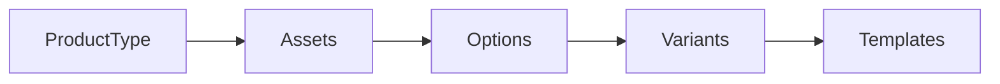

# Quickstart

Configure seu primeiro produto na Labanana em 5 passos.

:::info Pré-requisito
Você precisa de acesso admin à API. Base URL: `https://api.labanana.art`
:::

## Fluxo completo



## 1. Criar ProductType

O ProductType define uma categoria de produto (ex: "Caneca Cerâmica").

```http
POST /products/types
```

```json
{
  "slug": "caneca-ceramica",
  "name": "Caneca Cerâmica",
  "description": "Caneca de cerâmica personalizada",
  "platformFeePercent": 15,
  "artistRoyaltyPercent": 20
}
```

## 2. Adicionar Assets

Assets são características **estruturais** que afetam fabricação e custo.

```http
POST /products/types/{product_type_id}/assets/bulk
```

```json
{
  "assets": [
    { "key": "size", "keyLabelPt": "Tamanho", "value": "350ml", "labelPt": "350ml" },
    { "key": "size", "keyLabelPt": "Tamanho", "value": "700ml", "labelPt": "700ml" },
    { "key": "finish", "keyLabelPt": "Acabamento", "value": "glossy", "labelPt": "Brilhante" },
    { "key": "finish", "keyLabelPt": "Acabamento", "value": "matte", "labelPt": "Fosco" }
  ]
}
```

## 3. Adicionar Options

Options são características **visuais** que o cliente escolhe na loja.

```http
POST /products/types/{product_type_id}/options
```

```json
{
  "key": "color",
  "labelPt": "Cor",
  "inputType": "color_picker",
  "displayBehavior": "filter",
  "required": true,
  "values": [
    { "value": "black", "labelPt": "Preto", "hexColor": "#000000" },
    { "value": "white", "labelPt": "Branco", "hexColor": "#FFFFFF" },
    { "value": "red", "labelPt": "Vermelho", "hexColor": "#FF0000" },
    { "value": "blue", "labelPt": "Azul", "hexColor": "#0000FF" }
  ]
}
```

## 4. Gerar Variants

Use o endpoint de geração automática para criar todas as combinações.

```http
POST /products/types/{product_type_id}/generate-variants
```

```json
{
  "baseCostCents": 1500,
  "productionDays": 3,
  "packagingDays": 1
}
```

Isso gera **4 variants** (2 sizes x 2 finishes), cada uma com custo padrão de R$ 15,00.

:::tip
Após gerar, use o **bulk update** para ajustar custos específicos (ex: 700ml custa mais).
:::

## 5. Criar Templates

Templates são os mockups onde a arte será composta.

```http
POST /products/types/{product_type_id}/templates
```

```json
{
  "displayName": "Caneca 350ml Preta",
  "assets": { "size": "350ml" },
  "options": { "color": "black" },
  "config": {
    "printArea": { "x": 100, "y": 50, "width": 400, "height": 300 },
    "sourceImage": { "width": 1000, "height": 800 }
  }
}
```

Depois, faça o upload da imagem base via [fluxo de presign](/docs/flows/image-upload).

---

## Pronto!

Seu catálogo está configurado. Agora o **seller** pode:

1. [Fazer upload da artwork](/docs/flows/seller-product#upload-da-artwork)
2. [Criar um SellerProduct com variantes](/docs/flows/seller-product#criar-produto)
3. [Gerar renders](/docs/flows/seller-product#renders)
4. [Publicar na loja](/docs/flows/seller-product#publicar)

## Próximos passos

- [Entender Assets vs Options](/docs/concepts/assets-and-options) — A distinção mais importante da plataforma
- [Fluxo Admin completo](/docs/flows/admin-setup) — Guia detalhado com todas as opções
- [API Reference](/docs/api-reference/endpoints) -- Todos os endpoints da plataforma
