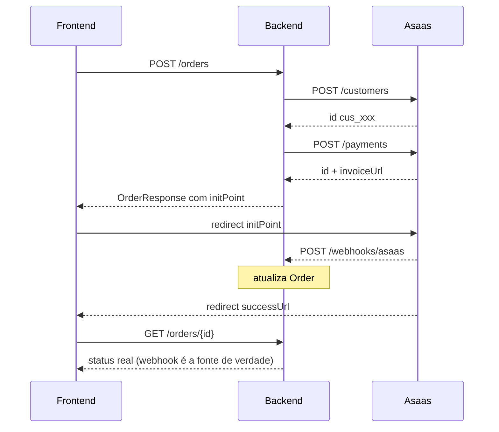

import StatusFlowDiagram from '@site/src/components/StatusFlowDiagram';

# Integração Asaas

Provider de pagamento da plataforma. O cliente é redirecionado para a página do Asaas (`invoiceUrl`) para pagar via **Pix**, **cartão** ou **boleto**.

- **Integração:** REST API v3 (sem SDK) — `app/services/asaas.py`
- **Docs:** [docs.asaas.com/reference](https://docs.asaas.com/reference)

## Arquitetura



## Pré-requisito: CPF/CNPJ

O Asaas **exige** documento para criar o customer. Se o usuário não tem `documentType` + `documentNumber` preenchidos, o `POST /orders` retorna erro.

- Coletar no cadastro ou antes do primeiro checkout
- Validações: CPF (11 dígitos + check digits), CNPJ (14 dígitos), ou `passport`
- Armazenado em `User.document_type` e `User.document_number`

Ver [Atualizar Perfil](/docs/api-reference/auth#atualizar-perfil).

## Ambientes

| Ambiente | API Base URL | Checkout URL |
|---|---|---|
| **Sandbox** (dev) | `https://api-sandbox.asaas.com/v3` | `https://sandbox.asaas.com/i/...` |
| **Produção** | `https://api.asaas.com/v3` | `https://www.asaas.com/i/...` |

## Variáveis de ambiente

<details>
<summary>Local (<code>.env</code>)</summary>

```env
# Asaas (sandbox)
ASAAS_API_KEY=$aact_hmlg_000...
ASAAS_BASE_URL=https://api-sandbox.asaas.com/v3

# URLs
FRONTEND_URL=https://dev.labanana.art
API_URL=http://localhost:8000

# Cloudflare Tunnel (webhook dev)
CLOUDFLARE_TUNNEL_TOKEN=eyJh...
TUNNEL_URL=https://localapi.labanana.art

# Webhook (opcional — valida token se configurado)
WEBHOOK_SECRET=meu-segredo
```

</details>

<details>
<summary>Produção (Railway Variables)</summary>

```env
ASAAS_API_KEY=$aact_prod_000...
ASAAS_BASE_URL=https://api.asaas.com/v3
FRONTEND_URL=https://labanana.art
API_URL=https://api.labanana.art
```

</details>

:::danger Guardrail de produção
O app **recusa iniciar** em `ENVIRONMENT=prod` se `ASAAS_API_KEY` está vazio.
:::

## Webhook

**Endpoint:** `POST /webhooks/asaas`

**Autenticação opcional:** se `WEBHOOK_SECRET` estiver configurado, o endpoint valida o token via header `asaas-access-token` ou query param `?token=`. Requests sem token válido recebem `401`.

<details>
<summary>Payload típico</summary>

```json
{
  "event": "PAYMENT_RECEIVED",
  "payment": {
    "id": "pay_080225913252",
    "customer": "cus_G7Dvo4iphUNk",
    "value": 71.9,
    "netValue": 68.5,
    "billingType": "PIX",
    "status": "RECEIVED",
    "externalReference": "uuid-da-order",
    "invoiceUrl": "https://www.asaas.com/i/080225913252",
    "paymentDate": "2026-04-02"
  }
}
```

</details>

### Mapeamento de status

| Asaas | Labanana `paymentStatus` |
|---|---|
| `PENDING` | `pending` |
| `RECEIVED` | `approved` |
| `CONFIRMED` | `approved` |
| `OVERDUE` | `pending` |
| `REFUNDED` | `refunded` |
| `REFUND_REQUESTED` | `pending` |
| `CHARGEBACK_REQUESTED` | `pending` |
| `CHARGEBACK_DISPUTE` | `pending` |
| `DUNNING_RECEIVED` | `approved` |
| `AWAITING_RISK_ANALYSIS` | `pending` |

### Eventos configurados no painel Asaas

- `PAYMENT_RECEIVED` — pagamento confirmado (Pix, cartão)
- `PAYMENT_CONFIRMED` — pagamento confirmado e creditado
- `PAYMENT_OVERDUE` — boleto vencido
- `PAYMENT_REFUNDED` — reembolso processado
- `PAYMENT_PARTIALLY_REFUNDED` — estorno parcial

### Proteção contra pagamento em order cancelada

Se o webhook recebe um evento para uma order já `cancelled` ou `refunded`, o backend:

1. **NÃO** atualiza o status da order
2. Se o pagamento foi confirmado (`RECEIVED`/`CONFIRMED`) — **estorna automaticamente** no Asaas → dinheiro devolvido ao cliente
3. Se o pagamento está pendente (`PENDING`) — **cancela/deleta** a cobrança no Asaas

:::tip Por que isso importa
Evita que o cliente pague um link antigo de uma order já cancelada e fique sem o dinheiro nem o produto.
:::

## Transições de paymentStatus

<StatusFlowDiagram
  title="paymentStatus — transições"
  states={[
    {id: 'pending',   label: 'pending',   description: 'Order criada, aguardando pagamento', tone: 'neutral'},
    {id: 'approved',  label: 'approved',  description: 'Pagamento confirmado pelo Asaas',     tone: 'success'},
    {id: 'rejected',  label: 'rejected',  description: 'Asaas rejeitou o pagamento',          tone: 'warning'},
    {id: 'refunded',  label: 'refunded',  description: 'Soma dos refunds atingiu o total',    tone: 'danger', terminal: true},
    {id: 'cancelled', label: 'cancelled', description: 'Order cancelada',                     tone: 'danger', terminal: true},
  ]}
  transitions={[
    {from: 'pending',  to: 'approved',  label: 'Asaas aprova',                 trigger: 'external'},
    {from: 'pending',  to: 'rejected',  label: 'Asaas rejeita',                trigger: 'external'},
    {from: 'pending',  to: 'cancelled', label: 'POST /cancel',                 trigger: 'admin'},
    {from: 'rejected', to: 'pending',   label: 'POST /pay (retry)',            trigger: 'admin'},
    {from: 'rejected', to: 'cancelled', label: 'POST /cancel',                 trigger: 'admin'},
    {from: 'approved', to: 'refunded',  label: 'POST /refund (total) ou /cancel', trigger: 'admin'},
    {from: 'approved', to: 'approved',  label: 'POST /refund parcial (mantém approved)', style: 'dashed', trigger: 'admin'},
  ]}
/>

## De-para de campos: API Asaas ↔ Labanana

### 1. Criar Customer — `POST /v3/customers`

Chamado automaticamente no `POST /orders`. Cria ou reutiliza customer por CPF.

| Campo Asaas | Obrigatório | Origem no Labanana |
|---|:---:|---|
| `name` | Sim | `Order.full_name` |
| `cpfCnpj` | Sim | `User.document_number` |
| `email` | Não | `User.email` |
| `mobilePhone` | Não | `Order.phone` (sem `+55`) |
| `externalReference` | Não | `str(User.id)` |

### 2. Criar Pagamento — `POST /v3/payments`

| Campo Asaas | Obrigatório | Origem no Labanana |
|---|:---:|---|
| `customer` | Sim | Customer ID (criado acima) |
| `billingType` | Sim | `"UNDEFINED"` (cliente escolhe no checkout) |
| `value` | Sim | `Order.total_cents / 100` |
| `description` | Não | Items concatenados: "2x Caneca Arte Tropical" |
| `externalReference` | Não | `str(Order.id)` — reconciliação no webhook |
| `callback.successUrl` | Não | `{FRONTEND_URL}/order/success?external_reference={orderId}` |

**Response:**

| Campo | Armazenado em |
|---|---|
| `id` (ex: `pay_xxx`) | `OrderPayment.provider_preference_id` |
| `invoiceUrl` | Retornado como `initPoint` no `OrderResponse` |
| `status` / `value` / `netValue` | Log |

### 3. Reembolso — `POST /v3/payments/{id}/refund`

| Campo | Obrigatório | Descrição |
|---|:---:|---|
| `value` | Não | Valor parcial em BRL. Se omitido = total |

Response: Payment com `status: "REFUNDED"` ou `"REFUND_REQUESTED"`.

### 4. Cancelamento — `DELETE /v3/payments/{id}`

Cancela um pagamento pendente. Equivale a deletar a cobrança no Asaas.

## Reembolso e cancelamento

Os endpoints [`POST /orders/{id}/refund`](/docs/api-reference/orders#7-reembolsar-pedido-admin) e [`POST /orders/{id}/cancel`](/docs/api-reference/orders#8-cancelar-pedido-admin) encapsulam a lógica de Asaas:

- **Refund total** → `paymentStatus: "refunded"`
- **Refund parcial** → `paymentStatus` continua `"approved"` até que a soma atinja o total
- **Cancel em order `approved`** → emite refund total automaticamente
- **Cancel em order `pending` com payment no Asaas** → deleta a cobrança
- **Cancel em order `pending` sem Asaas** → cancela só no banco

## Troubleshooting

| Problema | Causa | Solução |
|---|---|---|
| Webhook não chega | Tunnel não está rodando | `docker compose logs tunnel` |
| `Document is required` | User sem CPF/CNPJ | `PATCH /users/me` com `documentType` + `documentNumber` |
| `Failed to create payment` | API key inválida | Verificar `ASAAS_API_KEY` no `.env` |
| `CORS error` no frontend | Backend retornando 500 | `docker compose logs web` — o erro real está lá |
| `dev-pay` retorna 403 | `ENVIRONMENT` não é dev | Verificar `.env` |
| App não inicia em prod | API key vazia | Guardrail: prod exige `ASAAS_API_KEY` |
| Warnings de `$` no docker-compose | API key do Asaas contém `$` | Inofensivo — pydantic lê o `.env` diretamente |

:::info Sandbox é estável
Pix e cartão funcionam normalmente em ambiente de teste. Ver [Teste E2E com Cloudflare Tunnel](#) _(em breve na seção de Desenvolvimento)_.
:::
