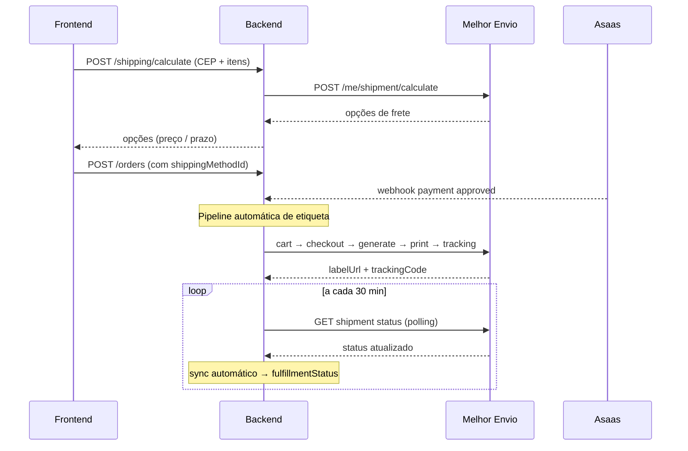

import ShippingTimeline from '@site/src/components/ShippingTimeline';

# Integração Melhor Envio

Gateway de envio. Suporta Correios (PAC, SEDEX, Mini Envios), Jadlog, Loggi e outros. **O frontend nunca fala diretamente com o Melhor Envio** — todas as chamadas passam pelo backend.

- **Integração:** REST API v2 direta (sem SDK) — `app/services/melhor_envio.py`
- **Docs:** [docs.melhorenvio.com.br](https://docs.melhorenvio.com.br)

## Arquitetura



## Conceitos-chave

| Conceito | O que é |
|---|---|
| **Endereço de origem** | Armazém/gráfica de onde saem os pedidos — vem das env vars `MELHOR_ENVIO_FROM_*` |
| **Documento do destinatário** | CPF/CNPJ vem automaticamente do cadastro do usuário. ME **não permite** remetente e destinatário com mesmo CPF |
| **Dimensões do produto** | Armazenadas no `ProductVariant` (`weightGrams`, `heightCm`, `widthCm`, `lengthCm`) |
| **Etiqueta automática** | Gerada automaticamente após pagamento aprovado — sem ação do admin |
| **Provider genérico** | `OrderShipment` usa campos genéricos (`shipping_provider`, `provider_order_id`, `label_url`) — facilita trocar de gateway no futuro |

## Dimensões no ProductVariant

Cada variante precisa de dimensões físicas para cálculo de frete:

| Campo | Tipo | Exemplo | Descrição |
|---|---|---|---|
| `weightGrams` | int | `300` | Peso em gramas |
| `heightCm` | int | `4` | Altura em cm |
| `widthCm` | int | `12` | Largura em cm |
| `lengthCm` | int | `17` | Comprimento em cm |

:::warning Fallback quando não preenchidas
Se uma variante não tem dimensões, o backend usa valores padrão (`300g`, `2x15x20cm`) e loga um warning. Configure as dimensões reais via `POST`/`PATCH` bulk.
:::

```json
POST /products/types/{id}/variants
{
  "assetIds": ["uuid-size-350ml"],
  "baseCostCents": 2500,
  "weightGrams": 450,
  "heightCm": 10,
  "widthCm": 9,
  "lengthCm": 9
}
```

## 1. Calcular Frete

```http
POST /shipping/calculate
```

Sem autenticação. O backend carrega dimensões/peso do `ProductVariant` e monta o payload.

```json
{
  "toCep": "01018-020",
  "items": [
    { "variantId": "uuid-da-variante", "quantity": 2 },
    { "variantId": "uuid-outra-variante", "quantity": 1 }
  ]
}
```

<details>
<summary>Response</summary>

```json
{
  "fromCep": "01310100",
  "options": [
    {
      "id": 1,
      "name": "PAC",
      "companyName": "Correios",
      "priceCents": 2693,
      "deliveryMin": 7,
      "deliveryMax": 9,
      "carrier": "correios",
      "serviceCode": "PAC",
      "companyPicture": "https://..."
    },
    {
      "id": 2,
      "name": "SEDEX",
      "companyName": "Correios",
      "priceCents": 3588,
      "deliveryMin": 3,
      "deliveryMax": 4,
      "carrier": "correios",
      "serviceCode": "SEDEX"
    },
    {
      "id": 3,
      "name": ".Package",
      "companyName": "Jadlog",
      "priceCents": 2100,
      "deliveryMin": 5,
      "deliveryMax": 6,
      "carrier": "jadlog",
      "serviceCode": ".Package"
    }
  ]
}
```

</details>

Opções com erro (transportadora não atende, peso excede, etc.) são removidas automaticamente.

## 2. Criar pedido com frete

O frontend envia a opção escolhida no payload do `POST /orders`:

```json
{
  "shipping": { "...": "endereço" },
  "items": [{ "...": "itens" }],
  "shippingCents": 2693,
  "shippingMethodId": "1",
  "carrier": "correios",
  "serviceCode": "PAC"
}
```

`shippingMethodId`, `carrier` e `serviceCode` vêm diretamente da opção escolhida em `/shipping/calculate`.

## 3. Pipeline automática de etiqueta

Logo após o webhook do Asaas confirmar o pagamento (ou após `dev-pay`), o backend executa 5 chamadas sequenciais no ME. Tudo em **best-effort** — se algum passo falhar, o erro é logado mas o pedido permanece em `approved`.

<ShippingTimeline
  title="Pipeline de etiqueta — disparada no payment approved"
  steps={[
    {
      id: 'cart',
      label: 'Criar envio (cart)',
      actor: 'sistema',
      description: 'POST /me/cart — cria envio no ME, retorna provider_order_id e delivery_max.',
      note: 'Salva providerOrderId + etaDays no OrderShipment (usa delivery_max do nível raiz, não delivery_range).'
    },
    {
      id: 'checkout',
      label: 'Comprar frete (checkout)',
      actor: 'sistema',
      description: 'POST /me/shipment/checkout — debita saldo do ME. Tenta extrair trackingCode (geralmente null).'
    },
    {
      id: 'generate',
      label: 'Gerar etiqueta',
      actor: 'sistema',
      description: 'POST /me/shipment/generate — ME monta o PDF da etiqueta. Segunda tentativa de extrair trackingCode.'
    },
    {
      id: 'print',
      label: 'Obter URL do PDF',
      actor: 'sistema',
      description: 'POST /me/shipment/print — retorna labelUrl do PDF. Salva em OrderShipment.labelUrl.'
    },
    {
      id: 'tracking',
      label: 'Buscar trackingCode',
      actor: 'sistema',
      description: 'POST /me/shipment/tracking — só roda se trackingCode ainda é null após os passos anteriores.',
      note: 'Se ainda null, o tracking poller preenche depois (ver próxima seção).'
    },
  ]}
/>

### Dados extraídos automaticamente

| Campo | De onde vem |
|---|---|
| `etaDays` | `delivery_max` do nível raiz do response do cart (passo 1). **Atenção:** `delivery_range` vem `null` |
| `labelUrl` | Response do print (passo 4) |
| `trackingCode` | Tentado nos passos 2, 3 e 5 — se ainda `null`, fica a cargo do polling |

<details>
<summary>Response do pedido após etiqueta gerada</summary>

```json
{
  "id": "uuid-do-pedido",
  "paymentStatus": "approved",
  "shipment": {
    "id": "uuid-do-shipment",
    "carrier": "correios",
    "serviceCode": "PAC",
    "shippingMethodId": "1",
    "label": "PAC - Correios",
    "priceCents": 2693,
    "etaDays": 8,
    "shippingProvider": "melhor_envio",
    "providerOrderId": "me-uuid-xxx",
    "labelUrl": "https://sandbox.melhorenvio.com.br/imprimir/xxx",
    "trackingCode": null,
    "status": "pending"
  }
}
```

</details>

## 4. Tracking Polling (estratégia principal)

:::tip Polling > Webhook
**Polling é a estratégia principal** de atualização de status — não o webhook. O webhook do ME é instável no sandbox e depende de configuração externa, então o polling é mais confiável e funciona em qualquer ambiente.
:::

Um serviço roda a cada **30 minutos** (container `tracking-poller` no `docker-compose.yml`) e consulta a API do ME para atualizar todos os shipments ativos.

### Quais shipments são polled

- Têm `provider_order_id` preenchido (ou seja: passo 1 da pipeline completou)
- Status **não** é terminal (`delivered` ou `returned`)

### O que é atualizado

| Campo | Atualização |
|---|---|
| `status` | Mapeado do status ME |
| `tracking_code` | Preenchido se ainda era `null` |
| `shipped_at` / `delivered_at` | Timestamps quando muda para `shipped`/`delivered` |
| `tracking_last_event_payload` | JSON do polling (útil para debug) |
| `OrderItem.trackingCode` | Copiado do `OrderShipment` (sync automático — desde abril/2026) |
| `OrderItem.fulfillmentStatus` | Propagado automaticamente do `shipment.status` |

### Endpoint admin — trigger manual

```http
POST /shipping/poll-tracking
```

Requer JWT de admin. Dispara o polling sob demanda (em vez de esperar 30min).

<details>
<summary>Response</summary>

```json
{
  "total": 3,
  "updated": 1,
  "errors": 0,
  "details": [
    {
      "me_order_id": "a18d7597-...",
      "changed": true,
      "me_status": "posted",
      "our_status": "shipped",
      "tracking": "PX12792017BR",
      "old_status": "pending"
    }
  ]
}
```

</details>

### Rodando manualmente em dev

```bash
# Ver logs do poller
docker compose logs -f tracking-poller

# Executar uma vez dentro do container
docker exec labanana-api-web-1 python -m scripts.poll_tracking
```

### Arquivos relevantes

| Arquivo | O que faz |
|---|---|
| `app/routers/shipping.py` | `poll_active_shipments()`, `_poll_shipment()`, endpoint `POST /shipping/poll-tracking` |
| `app/crud/order.py` | `get_active_shipments()` — query dos shipments ativos |
| `scripts/poll_tracking.py` | Script standalone usado pelo cron |
| `docker-compose.yml` | Serviço `tracking-poller` |

## 5. Webhook (bonus)

**Endpoint:** `POST /webhooks/melhor-envio`

Quando funciona, atualiza o status em tempo real — mas o polling é a fonte de verdade.

### Cadastro no painel ME

1. **Integrações > Área Dev**
2. **Cadastrar Aplicativo** (se ainda não tiver)
3. Dentro do app, **Novo Webhook**
4. URL: `{API_URL}/webhooks/melhor-envio` (em dev, usar URL do tunnel)
5. Marcar o evento **"Atualização das etiquetas criadas e editadas"**

:::warning Mesmo token
As etiquetas precisam ser geradas usando o **mesmo token/aplicativo** onde o webhook está configurado, senão o webhook não dispara.
:::

### Payload recebido

```json
{
  "event": "order.posted",
  "data": {
    "id": "me-order-uuid",
    "protocol": "ORD-2024XXXXXXXXXX",
    "status": "posted",
    "tracking": "RASTREIO123BR",
    "tracking_url": "https://www.melhorrastreio.com.br/rastreio/RASTREIO123BR"
  }
}
```

- **Header de verificação:** `X-ME-Signature` — HMAC-SHA256 do body usando o Secret do aplicativo como chave
- **Retry:** 5 tentativas com intervalo de 15min, timeout de 6s por request

## Mapeamento de status

| Melhor Envio | Labanana `ShipmentStatus` |
|---|---|
| `pending` | `pending` |
| `released` | `pending` |
| `posted` | `shipped` |
| `in_transit` | `in_transit` |
| `delivered` | `delivered` |
| `canceled` | `returned` |
| `undelivered` | `returned` |

## Link de rastreio (frontend)

Use o Melhor Rastreio:

```
https://www.melhorrastreio.com.br/rastreio/{trackingCode}
```

O frontend monta o link a partir do `trackingCode` retornado em `OrderShipmentResponse`.

## Configuração `.env`

<details>
<summary>Sandbox</summary>

```bash
MELHOR_ENVIO_TOKEN=eyJ0eXAi...
MELHOR_ENVIO_BASE_URL=https://sandbox.melhorenvio.com.br/api/v2

# Endereço do remetente (armazém/gráfica)
MELHOR_ENVIO_FROM_CEP=01310100
MELHOR_ENVIO_FROM_NAME=Labanana
MELHOR_ENVIO_FROM_PHONE=+5519999999999
MELHOR_ENVIO_FROM_EMAIL=contact@labanana.art
MELHOR_ENVIO_FROM_DOCUMENT=12345678000199
MELHOR_ENVIO_FROM_ADDRESS=Rua Exemplo
MELHOR_ENVIO_FROM_NUMBER=123
MELHOR_ENVIO_FROM_COMPLEMENT=Sala 1
MELHOR_ENVIO_FROM_DISTRICT=Centro
MELHOR_ENVIO_FROM_CITY=Campinas
MELHOR_ENVIO_FROM_STATE=SP
```

</details>

**Campos obrigatórios do remetente:** `phone`, `address`, `city` são exigidos pelo ME para Jadlog (service 3). Os demais são recomendados para todas as transportadoras.

:::danger Guardrail de produção
O app recusa iniciar em `ENVIRONMENT=prod` se `MELHOR_ENVIO_TOKEN` ou `MELHOR_ENVIO_FROM_CEP` estão vazios.
:::

## Ambientes

| Ambiente | Base URL | Saldo |
|---|---|---|
| **Sandbox** | `https://sandbox.melhorenvio.com.br/api/v2` | R$ 10.000 fictícios |
| **Produção** | `https://melhorenvio.com.br/api/v2` | Saldo real da carteira ME |

:::info Ciclo de vida no sandbox
- ~15min após gerar etiqueta → status muda para `posted` + webhook disparado
- ~15min após postagem → status muda para `delivered` + webhook disparado
- `trackingCode` é atribuído quando muda para `posted`

Apenas **Correios** e **Jadlog** estão disponíveis no sandbox.
:::

## Cálculo do pacote (MVP)

Volume único por pedido:

- **Peso total** = soma de `weight_grams × quantity` de cada item
- **Dimensões** = maior altura, largura e comprimento entre todos os itens

Simplificado — no futuro, implementar lógica de empacotamento (múltiplos volumes, envelope vs caixa).

## Fluxo completo resumido

```
1. Cliente digita CEP na página do produto/carrinho
   → POST /shipping/calculate
   → mostra opções com preço e prazo

2. Cliente escolhe opção e vai pro checkout
   → POST /orders com shippingMethodId + shippingCents

3. Cliente paga (Asaas — Pix/cartão/boleto)

4. Webhook Asaas → payment approved
   → Pipeline automática de etiqueta (cart → checkout → generate → print → tracking)
   → Salva labelUrl + trackingCode no OrderShipment

5. Admin imprime etiqueta (PDF no labelUrl)
   → Posta o pacote

6. Tracking poller (a cada 30min)
   → Atualiza status: pending → shipped → in_transit → delivered
   → Preenche trackingCode se ainda null
   → Propaga para OrderItem.fulfillmentStatus e OrderItem.trackingCode

7. Webhook ME (bonus, quando funcionar)
   → Atualiza em tempo real
```

## Troubleshooting

| Problema | Causa | Solução |
|---|---|---|
| Cálculo retorna 0 opções | CEP inválido ou sem cobertura | Verificar CEP de destino |
| Frete muito caro | Dimensões/peso incorretos | Verificar `weightGrams`, `heightCm`, etc. |
| Etiqueta não gerou | Saldo ME insuficiente ou dados incompletos | Verificar logs e saldo no painel ME |
| `MELHOR_ENVIO_TOKEN not configured` | Token vazio no `.env` | Adicionar `MELHOR_ENVIO_TOKEN` |
| Dimensões fallback nos logs | Variante sem dimensões preenchidas | Atualizar via `PATCH` bulk |
| `trackingCode` null após etiqueta | ME não atribui imediatamente | Aguardar polling ou chamar `POST /shipping/poll-tracking` |
| Poller não atualiza | Shipment sem `provider_order_id` | Verificar se pipeline de etiqueta completou |
