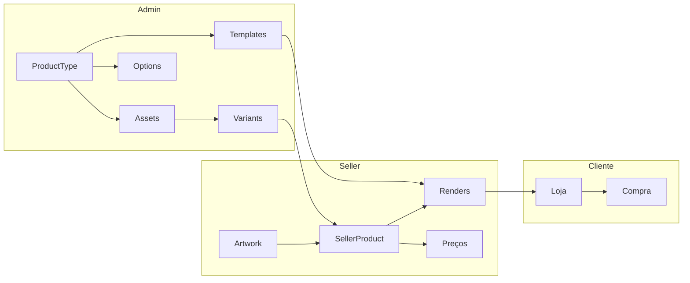

# Labanana API

Construa produtos print-on-demand usando nossa plataforma.

Labanana é um marketplace de print-on-demand. Artistas fazem upload de suas artes e as aplicam em produtos (canecas, camisetas, posters). A plataforma cuida da fabricação e entrega.

## Quem faz o quê

| Perfil | O que faz | Guia |
|--------|-----------|------|
| **Admin** | Configura catálogo: tipos de produto, assets, options, variants, templates | [Guia do Admin](/docs/flows/admin-setup) |
| **Seller (artista)** | Upload de arte, cria produtos, configura renders, define preços, publica | [Guia do Seller](/docs/flows/seller-product) |
| **Cliente** | Navega a loja, escolhe variantes/opções, compra | [Frontend](/docs/frontend/public-page) |

## Comece por aqui

  

### Quickstart

Novo na Labanana? Configure seu primeiro produto em 5 minutos.

[Ir para o Quickstart](/docs/getting-started/quickstart)

  

  

### Conceitos

Entenda a distinção entre Assets e Options — o coração da plataforma.

[Ver Conceitos](/docs/concepts/assets-and-options)

  

  

### Sou Seller

Já tem acesso? Vá direto para o fluxo de criação de produto.

[Guia do Seller](/docs/flows/seller-product)

  

:::tip API Interativa
Acesse a documentação interativa: [Swagger UI](https://api.labanana.art/docs) | [ReDoc](https://api.labanana.art/redoc)
:::
